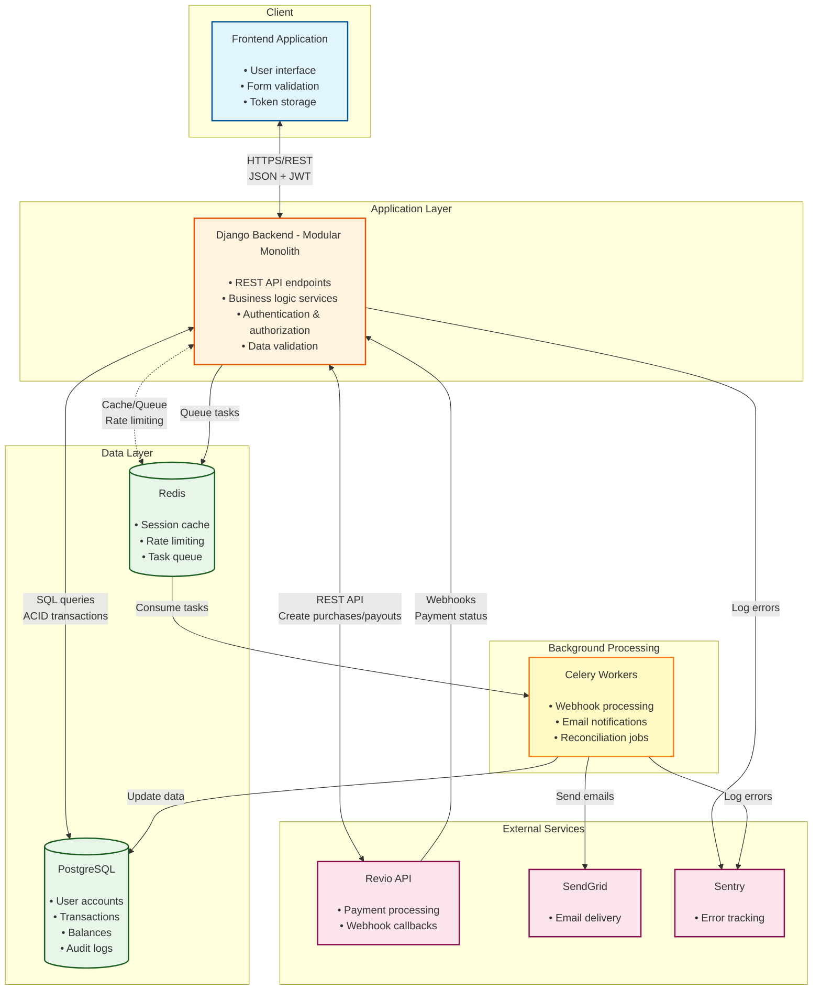
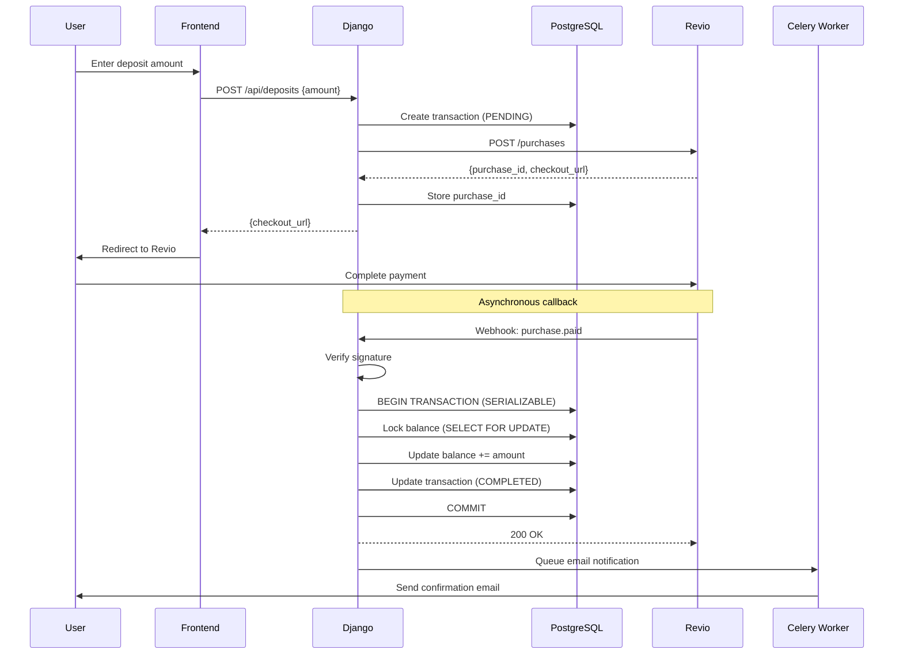
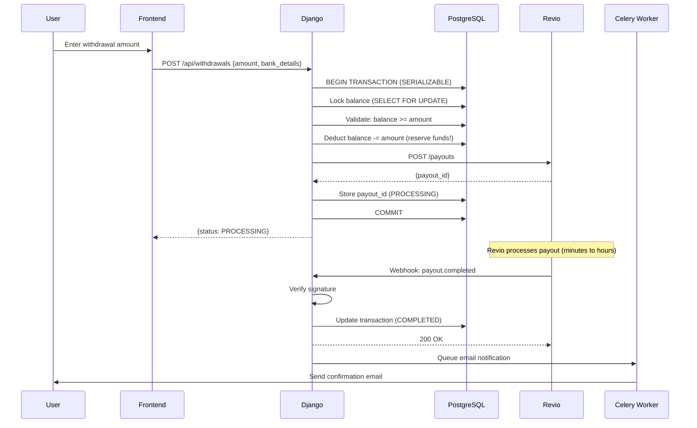

# System Architecture Diagram

## Overview
This document presents the high-level architecture for the Octoco Quiz backend system, showing how components interact and data flows through the system.

---

## Architecture Decision

**Chosen Architecture**: **Modular Monolith with Event-Driven Elements**

**Rationale**:
- Simple to develop, test, and deploy (small team, tight timeline)
- Strong consistency guarantees for financial transactions (ACID)
- Cost-effective initial deployment (~$110/month)
- Clear path to scale horizontally (0-100K users without major rewrite)
- Leverages Django's strengths (batteries-included framework)
- Can extract microservices later if needed

---

## High-Level Component Diagram



---

## Component Responsibilities

### 1. Frontend Application
**Technology**: React/Vue/Angular (handled by frontend team)

**Responsibilities**:
- User interface for deposits, withdrawals, transaction history
- Client-side validation
- JWT token management
- Redirect users to Revio checkout pages

---

### 2. Django Backend (Modular Monolith)
**Technology**: Python + Django + Django REST Framework

**Internal Structure**:
```
apps/
├── accounts/       # User authentication & authorization
├── transactions/   # Deposits, withdrawals, balance management
├── webhooks/       # Webhook signature verification & processing
└── notifications/  # Email/SMS notification logic
```

**Responsibilities**:
- **API Endpoints**: REST APIs for all user operations
- **Authentication**: JWT-based auth (access + refresh tokens)
- **Authorization**: Role-based access control (user, admin)
- **Business Logic**: Transaction processing, balance updates
- **Webhook Handling**: Verify signatures, ensure idempotency
- **Integration**: Call Revio API, enqueue background tasks

**Communication**:
- Receives requests from frontend (HTTPS/REST)
- Queries PostgreSQL for data (SQL, ACID transactions)
- Calls Revio API for payments (HTTPS/REST)
- Queues tasks in Redis for async processing
- Caches frequently accessed data in Redis

---

### 3. PostgreSQL Database
**Technology**: PostgreSQL 16+

**Responsibilities**:
- Store all persistent data (users, transactions, balances)
- Enforce data integrity (foreign keys, constraints, unique indexes)
- Provide ACID transaction guarantees
- Handle concurrent access with MVCC (Multi-Version Concurrency Control)

**Key Tables**:
- `users` - User accounts and credentials
- `balances` - User balances (one-to-one with users)
- `transactions` - Deposit/withdrawal records
- `webhook_logs` - Audit trail of all webhooks

**Concurrency Control**:
- Uses **SERIALIZABLE** isolation level for balance updates
- Uses **SELECT FOR UPDATE** (pessimistic locking) to prevent race conditions

---

### 4. Redis Cache
**Technology**: Redis 7+

**Responsibilities**:
- **Caching**: User balances, JWT tokens (reduce DB queries)
- **Rate Limiting**: Track request counts per user/endpoint
- **Task Queue**: Celery broker for background jobs
- **Idempotency**: Track processed webhook IDs (prevent duplicates)

**Data Examples**:
- `balance:user:123` → cached balance (TTL: 5 min)
- `webhook:processed:evt_abc` → flag (TTL: 7 days)
- `celery:queue:default` → task queue

---

### 5. Celery Workers
**Technology**: Celery + Redis (broker)

**Worker Types**:
- **Webhook Processor**: Process webhooks asynchronously, retry on failure
- **Notification Worker**: Send emails/SMS, retry on failure
- **Reconciliation Worker**: Periodic job (every 15 min) to sync with Revio

**Why Async**:
- Webhooks must respond quickly (< 5 sec) to Revio
- Email sending shouldn't block API responses
- Reconciliation handles missed webhooks

---

### 6. Revio API (External)
**Integration**: REST API

**Operations**:
- `POST /purchases` - Create deposit (get checkout URL)
- `POST /payouts` - Create withdrawal
- `GET /purchases/:id` - Query deposit status (reconciliation)
- Webhook callbacks - Notify payment status changes

**Security**:
- API key authentication
- RSA-SHA256 webhook signature verification

---

### 7. SendGrid (External)
**Integration**: REST API

**Usage**:
- Send transaction confirmations
- Send password reset emails
- Send withdrawal status updates

---

### 8. Sentry (External)
**Integration**: Python SDK

**Usage**:
- Capture exceptions and stack traces
- Monitor performance (APM)
- Alert on error rate spikes

---

## Communication Patterns

### Synchronous (Request-Response)
**Used for**: User-facing API calls

**Example: Check Balance**
```
User → Frontend → Django API → PostgreSQL → Return balance
```

**Characteristics**:
- Low latency (< 100ms)
- Strong consistency
- Blocking operation

---

### Asynchronous (Task Queue)
**Used for**: Non-critical background work

**Example: Send Email**
```
Django → Queue task in Redis → Celery Worker → SendGrid
```

**Characteristics**:
- Non-blocking (immediate API response)
- Higher latency (seconds to minutes)
- Retry on failure

---

### Webhook (External Callback)
**Used for**: Revio payment notifications

**Example: Deposit Completed**
```
Revio → Django webhook endpoint → Verify signature →
Queue processing task → Return 200 OK
```

**Characteristics**:
- Must respond quickly (< 5 sec)
- Idempotent processing required
- Signature verification critical

---

## Data Flow: Deposit



**Key Points**:
1. Transaction created immediately (PENDING status)
2. User redirected to Revio for payment
3. Webhook processed asynchronously with idempotency
4. Balance updated atomically with pessimistic locking
5. Email sent asynchronously

---

## Data Flow: Withdrawal



**Key Points**:
1. **Balance deducted immediately** (prevents double-spending)
2. If payout fails, balance is refunded
3. Transaction enters PROCESSING state
4. Webhook updates status to COMPLETED
5. Email sent asynchronously

---

## Scaling Strategy

### Phase 1: Single Instance (0-1K users)
```
1 Django server + 1 DB + 1 Redis + 1 Celery worker
Cost: ~$110/month
```

### Phase 2: Horizontal Scaling (1K-10K users)
```
3 Django servers (load balanced) + 1 DB + 1 Redis + 3 Celery workers
Add: Read replicas for DB
Cost: ~$250/month
```

### Phase 3: Advanced Scaling (10K-100K users)
```
10 Django servers (auto-scaling) + Primary DB + 2 Read Replicas
Redis Cluster + 10 Celery workers
Add: CDN, separate webhook workers
Cost: ~$600/month
```

### Phase 4: Microservices (100K+ users)
```
Extract high-load services:
- Webhook Service (Go) - independent scaling
- Keep transaction logic in Django
Use API Gateway, Kafka for events
Cost: ~$1,500/month
```

---

## Key Design Decisions

### 1. Why Monolith (Not Microservices)?
**Decision**: Start with modular monolith

**Tradeoffs**:
- ✅ Simpler: Single codebase, easier testing
- ✅ Faster: No network overhead between components
- ✅ Cheaper: Fewer infrastructure components
- ✅ Consistent: ACID transactions across all operations
- ❌ Coupled: All components deploy together
- ❌ Scaling: Must scale entire app (not individual parts)

**Mitigation**: Design with clear module boundaries, can extract services later

---

### 2. Why Async Webhook Processing?
**Decision**: Process webhooks asynchronously via Celery

**Tradeoffs**:
- ✅ Fast response: Return 200 OK to Revio quickly (< 1 sec)
- ✅ Resilient: Retry failed processing with exponential backoff
- ✅ Non-blocking: Don't hold webhook connection during DB operations
- ❌ Complexity: Need task queue infrastructure
- ❌ Eventual: Small delay between webhook and balance update

**Mitigation**: Implement idempotency, use Redis for fast queue

---

### 3. Why Pessimistic Locking?
**Decision**: Use SELECT FOR UPDATE for balance updates

**Tradeoffs**:
- ✅ Simple: Prevents race conditions with row-level locks
- ✅ Guaranteed: Ensures no double-spending
- ✅ Consistent: Strong consistency guarantees
- ❌ Blocking: Concurrent requests wait for lock release
- ❌ Performance: Can be slower under high contention

**Alternative**: Optimistic locking (version numbers) - more complex, better for high concurrency

**Decision Justification**: Financial accuracy > performance. Small wait times acceptable.

---

### 4. Why JWT (Not Sessions)?
**Decision**: Use JWT tokens for authentication

**Tradeoffs**:
- ✅ Stateless: No session storage needed
- ✅ Scalable: Works with load balancing (no sticky sessions)
- ✅ Fast: No DB lookup on every request
- ❌ Revocation: Hard to invalidate tokens before expiry
- ❌ Size: Larger than session IDs (sent on every request)

**Mitigation**: Use short-lived access tokens (15 min) + refresh tokens (7 days)

---

## Summary

**Architecture Type**: Modular Monolith with Event-Driven Elements

**Key Components**: Django Backend, PostgreSQL, Redis, Celery Workers, Revio API

**Communication**: Sync for user APIs, async for webhooks/notifications

**Concurrency**: Pessimistic locking + SERIALIZABLE isolation

**Scaling**: Horizontal scaling (multiple instances), read replicas, Redis caching

**Evolution Path**: Extract microservices when team/scale demands it
