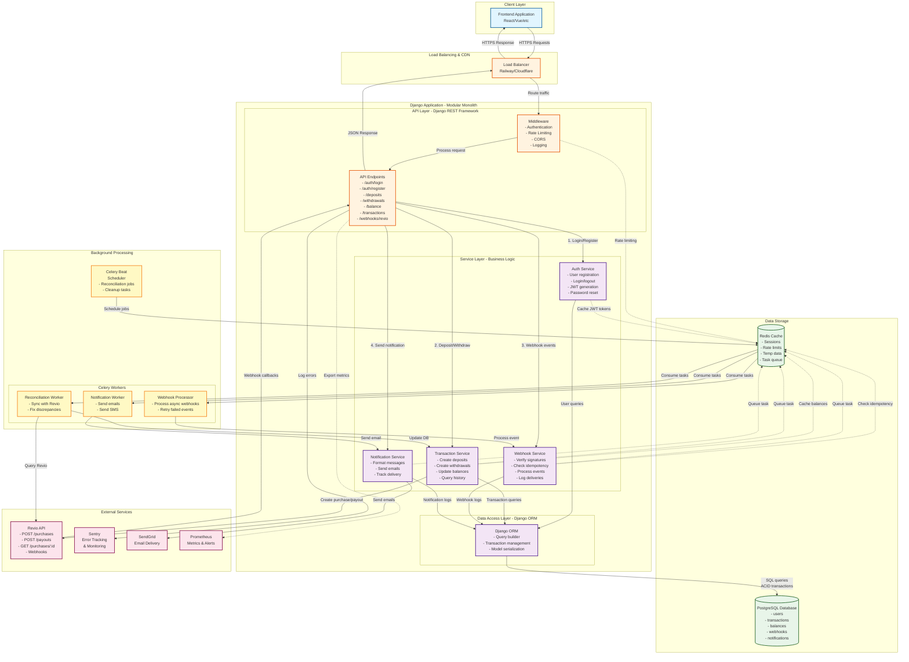

# Component Interaction Diagram

## Overview
This diagram shows how all components in the Octoco Quiz backend system interact with each other, including synchronous API calls, asynchronous event processing, and data flows.

---

## Complete System Component Diagram



---

## Component Descriptions

### 1. Frontend Application
**Technology**: React/Vue/Angular (not our concern, handled by frontend team)

**Responsibilities**:
- User interface and interactions
- Form validation
- API calls to backend
- Token storage (localStorage or httpOnly cookies)
- Redirect handling (Revio checkout flow)

**Communication**:
- → Load Balancer: HTTPS requests with JWT tokens
- ← Load Balancer: JSON responses

---

### 2. Load Balancer
**Technology**: Railway built-in load balancer + Cloudflare CDN

**Responsibilities**:
- Distribute traffic across multiple Django instances
- SSL/TLS termination
- DDoS protection
- Static asset caching (via Cloudflare)

**Communication**:
- → Django API: HTTP requests (internal network)
- ← Django API: HTTP responses

---

### 3. API Layer (Django REST Framework)

#### Middleware Stack
**Components**:
- `AuthenticationMiddleware`: Validates JWT tokens
- `RateLimitMiddleware`: Prevents abuse (django-ratelimit)
- `CorsMiddleware`: Handles CORS headers
- `LoggingMiddleware`: Request/response logging

**Flow**:
```
Request → CORS → Rate Limit → Auth → Logging → View → Response
```

#### API Endpoints
**Grouped by responsibility**:

**Auth Endpoints** (`/auth/`):
- `POST /auth/register` → Create user account
- `POST /auth/login` → Get JWT tokens
- `POST /auth/refresh` → Refresh access token
- `POST /auth/logout` → Invalidate refresh token

**Transaction Endpoints** (`/api/`):
- `POST /api/deposits` → Create deposit
- `POST /api/withdrawals` → Create withdrawal
- `GET /api/balance` → Get current balance
- `GET /api/transactions` → List transaction history
- `GET /api/transactions/:id` → Get transaction details

**Webhook Endpoints** (`/webhooks/`):
- `POST /webhooks/revio` → Receive Revio webhooks

**Communication**:
- → Services: Direct function calls (in-process)
- ← Services: Return values / exceptions

---

### 4. Service Layer (Business Logic)

#### Auth Service (`apps/accounts/services.py`)
**Responsibilities**:
- User registration and validation
- Password hashing (Django's PBKDF2)
- JWT token generation and validation
- Permission checking

**Key Methods**:
```python
class AuthService:
    def register(email, password) -> User
    def login(email, password) -> (access_token, refresh_token)
    def refresh_token(refresh_token) -> access_token
    def validate_token(token) -> User
```

**Communication**:
- → ORM: User CRUD operations
- → Redis: Cache user sessions
- → External: None

---

#### Transaction Service (`apps/transactions/services.py`)
**Responsibilities**:
- Create deposit/withdrawal transactions
- Update user balances with ACID guarantees
- Query transaction history
- Validate business rules (sufficient balance, limits)

**Key Methods**:
```python
class TransactionService:
    def create_deposit(user_id, amount) -> Transaction
    def create_withdrawal(user_id, amount, bank_details) -> Transaction
    def process_deposit_webhook(purchase_id) -> None
    def process_withdrawal_webhook(payout_id, status) -> None
    def get_balance(user_id) -> Decimal
    def get_transaction_history(user_id, filters) -> List[Transaction]
```

**Communication**:
- → ORM: Transaction and balance queries
- → Revio API: Create purchases/payouts
- → Redis: Cache balances, enqueue tasks
- → Celery: Queue notification tasks

**Concurrency Control**:
```python
@transaction.atomic(isolation_level='SERIALIZABLE')
def process_deposit_webhook(purchase_id: str):
    # Lock balance row to prevent race conditions
    balance = Balance.objects.select_for_update().get(...)
    balance.amount += transaction.amount
    balance.save()
```

---

#### Webhook Service (`apps/webhooks/services.py`)
**Responsibilities**:
- Verify webhook signatures (RSA-SHA256)
- Check idempotency (prevent duplicate processing)
- Log webhook deliveries for audit trail
- Route events to appropriate handlers

**Key Methods**:
```python
class WebhookService:
    def verify_signature(payload, signature) -> bool
    def is_duplicate(webhook_id) -> bool
    def process_webhook(event_type, payload) -> None
    def log_webhook(webhook_id, payload, status) -> WebhookLog
```

**Communication**:
- → ORM: Webhook log storage
- → Redis: Idempotency checks
- → Transaction Service: Process payment events
- → Sentry: Log signature verification failures

**Signature Verification**:
```python
from cryptography.hazmat.primitives import hashes, serialization
from cryptography.hazmat.primitives.asymmetric import padding

def verify_signature(payload: bytes, signature: str) -> bool:
    public_key = load_revio_public_key()
    try:
        public_key.verify(
            base64.b64decode(signature),
            payload,
            padding.PKCS1v15(),
            hashes.SHA256()
        )
        return True
    except InvalidSignature:
        return False
```

---

#### Notification Service (`apps/notifications/services.py`)
**Responsibilities**:
- Format email/SMS messages
- Send notifications via SendGrid
- Track delivery status
- Handle notification preferences

**Key Methods**:
```python
class NotificationService:
    def send_deposit_confirmation(user_id, amount) -> None
    def send_withdrawal_confirmation(user_id, amount) -> None
    def send_withdrawal_failed(user_id, reason) -> None
```

**Communication**:
- → SendGrid API: Send emails
- → ORM: Log notification status
- → Celery: Async sending (queued)

---

### 5. Data Access Layer (Django ORM)

**Responsibilities**:
- Abstract database queries
- Handle database connections
- Manage transactions (BEGIN, COMMIT, ROLLBACK)
- Type-safe model operations

**Models**:
```python
# apps/accounts/models.py
class User(AbstractUser):
    email = EmailField(unique=True)
    created_at = DateTimeField(auto_now_add=True)

# apps/transactions/models.py
class Transaction(Model):
    id = UUIDField(primary_key=True)
    user = ForeignKey(User)
    type = CharField(choices=['DEPOSIT', 'WITHDRAWAL'])
    amount = DecimalField(max_digits=19, decimal_places=4)
    status = CharField(choices=['PENDING', 'PROCESSING', 'COMPLETED', 'FAILED'])
    external_id = CharField()  # Revio purchase_id or payout_id
    created_at = DateTimeField(auto_now_add=True)

class Balance(Model):
    user = OneToOneField(User)
    amount = DecimalField(max_digits=19, decimal_places=4, default=0)
    updated_at = DateTimeField(auto_now=True)

# apps/webhooks/models.py
class WebhookLog(Model):
    id = UUIDField(primary_key=True)
    event_type = CharField()
    payload = JSONField()
    signature = CharField()
    status = CharField(choices=['RECEIVED', 'PROCESSED', 'FAILED'])
    received_at = DateTimeField(auto_now_add=True)
    processed_at = DateTimeField(null=True)
```

**Communication**:
- → PostgreSQL: SQL queries
- ← PostgreSQL: Result sets

---

### 6. PostgreSQL Database

**Responsibilities**:
- Store all persistent data
- Enforce data integrity (constraints, foreign keys)
- Provide ACID transaction guarantees
- Handle concurrent access with MVCC

**Schema** (simplified):
```sql
-- Users table
CREATE TABLE users (
    id SERIAL PRIMARY KEY,
    email VARCHAR(255) UNIQUE NOT NULL,
    password_hash VARCHAR(255) NOT NULL,
    is_active BOOLEAN DEFAULT TRUE,
    created_at TIMESTAMP DEFAULT NOW()
);

-- Balances table
CREATE TABLE balances (
    user_id INTEGER PRIMARY KEY REFERENCES users(id),
    amount NUMERIC(19, 4) DEFAULT 0 CHECK (amount >= 0),
    updated_at TIMESTAMP DEFAULT NOW()
);

-- Transactions table
CREATE TABLE transactions (
    id UUID PRIMARY KEY,
    user_id INTEGER REFERENCES users(id),
    type VARCHAR(20) CHECK (type IN ('DEPOSIT', 'WITHDRAWAL')),
    amount NUMERIC(19, 4) NOT NULL,
    status VARCHAR(20) CHECK (status IN ('PENDING', 'PROCESSING', 'COMPLETED', 'FAILED')),
    external_id VARCHAR(255),
    created_at TIMESTAMP DEFAULT NOW()
);

-- Webhook logs table
CREATE TABLE webhook_logs (
    id UUID PRIMARY KEY,
    event_type VARCHAR(50),
    payload JSONB,
    signature VARCHAR(500),
    status VARCHAR(20),
    received_at TIMESTAMP DEFAULT NOW(),
    processed_at TIMESTAMP
);

-- Indexes for performance
CREATE INDEX idx_transactions_user_id ON transactions(user_id);
CREATE INDEX idx_transactions_external_id ON transactions(external_id);
CREATE INDEX idx_transactions_status ON transactions(status);
CREATE INDEX idx_webhook_logs_event_type ON webhook_logs(event_type);
```

**Communication**:
- ← ORM: SQL queries (SELECT, INSERT, UPDATE, DELETE)
- → ORM: Result sets

---

### 7. Redis Cache

**Responsibilities**:
- Cache frequently accessed data (user balances, JWT tokens)
- Rate limiting state
- Celery task queue (broker)
- Session storage
- Idempotency tracking

**Data Structures**:
```
# Balance cache
balance:user:123 → "1500.50" (TTL: 5 minutes)

# Rate limiting
ratelimit:user:123:deposits → 3 (TTL: 1 hour)

# Idempotency
webhook:processed:evt_abc123 → 1 (TTL: 7 days)

# Celery queues
celery:queue:default → [task1, task2, task3]
celery:queue:webhooks → [webhook_task1]
celery:queue:notifications → [email_task1]
```

**Communication**:
- ← Services: GET, SET, INCR, LPUSH, etc.
- ← Celery: Task queue operations

---

### 8. Celery Workers

#### Celery Beat (Scheduler)
**Responsibilities**:
- Schedule periodic tasks
- Trigger reconciliation jobs
- Cleanup old logs

**Schedule**:
```python
# celery.py
beat_schedule = {
    'reconcile-transactions': {
        'task': 'apps.transactions.tasks.reconcile_with_revio',
        'schedule': crontab(minute='*/15'),  # Every 15 minutes
    },
    'cleanup-old-webhooks': {
        'task': 'apps.webhooks.tasks.cleanup_old_logs',
        'schedule': crontab(hour=2, minute=0),  # Daily at 2 AM
    },
}
```

#### Webhook Processor Worker
**Responsibilities**:
- Process webhook events asynchronously
- Retry failed webhooks with exponential backoff
- Update transaction statuses

**Tasks**:
```python
# apps/webhooks/tasks.py
@shared_task(bind=True, max_retries=3)
def process_webhook_async(self, webhook_id: str):
    try:
        webhook = WebhookLog.objects.get(id=webhook_id)
        webhook_service.process_webhook(webhook.event_type, webhook.payload)
    except Exception as exc:
        raise self.retry(exc=exc, countdown=60 * (2 ** self.request.retries))
```

#### Notification Worker
**Responsibilities**:
- Send emails asynchronously
- Send SMS (if implemented)
- Retry failed deliveries

**Tasks**:
```python
# apps/notifications/tasks.py
@shared_task
def send_email_async(recipient: str, subject: str, body: str):
    notification_service.send_email(recipient, subject, body)
```

#### Reconciliation Worker
**Responsibilities**:
- Query Revio API for transaction status
- Compare with internal database
- Fix discrepancies
- Alert admins of issues

**Tasks**:
```python
# apps/transactions/tasks.py
@shared_task
def reconcile_with_revio():
    # Get all PROCESSING transactions older than 1 hour
    stuck_transactions = Transaction.objects.filter(
        status='PROCESSING',
        created_at__lt=timezone.now() - timedelta(hours=1)
    )

    for txn in stuck_transactions:
        # Query Revio for actual status
        revio_status = revio_client.get_transaction_status(txn.external_id)

        # Update if status changed
        if revio_status != txn.status:
            transaction_service.update_from_revio_status(txn.id, revio_status)
```

**Communication**:
- → Services: Call service methods
- → Revio API: Query transaction status
- → Sentry: Log errors

---

### 9. External Services

#### Revio API
**Endpoints Used**:
- `POST /purchases` - Create deposit
- `POST /payouts` - Create withdrawal
- `GET /purchases/:id` - Query deposit status
- `GET /payouts/:id` - Query withdrawal status
- Webhooks: Receive callbacks

**Communication**:
- ← Transaction Service: Create purchases/payouts
- ← Reconciliation Worker: Query status
- → Django API: Send webhooks

**Authentication**:
```python
headers = {
    'Authorization': f'Bearer {settings.REVIO_API_KEY}',
    'Content-Type': 'application/json'
}
```

---

#### Sentry (Error Tracking)
**Usage**:
- Capture exceptions
- Track performance (APM)
- Alert on errors

**Integration**:
```python
import sentry_sdk

sentry_sdk.init(
    dsn=settings.SENTRY_DSN,
    environment=settings.ENVIRONMENT,
    traces_sample_rate=0.1,  # 10% of transactions
)
```

---

#### SendGrid (Email)
**Usage**:
- Send transaction confirmations
- Send password reset emails
- Send account notifications

**Communication**:
- ← Notification Service: Send emails

---

#### Prometheus (Metrics)
**Metrics Collected**:
- Request count by endpoint
- Response time (p50, p95, p99)
- Database query time
- Celery task duration
- Error rate

**Integration**:
```python
from prometheus_client import Counter, Histogram

request_count = Counter('http_requests_total', 'Total requests')
request_duration = Histogram('http_request_duration_seconds', 'Request duration')
```

---

## Communication Patterns

### 1. Synchronous Communication (Request-Response)

**Flow**: Frontend → API → Service → ORM → Database

**Example: User checks balance**
```
1. Frontend: GET /api/balance (Authorization: Bearer token)
2. Load Balancer: Route to Django instance
3. Middleware: Validate JWT token
4. API View: Call TransactionService.get_balance(user_id)
5. Service: Check Redis cache
   - Cache hit → Return cached value
   - Cache miss → Query database
6. ORM: SELECT amount FROM balances WHERE user_id = ?
7. Database: Return balance
8. Service: Cache result in Redis (TTL: 5 min)
9. API: Return JSON response {"balance": "1500.50"}
10. Frontend: Display balance
```

**Characteristics**:
- Blocking call (wait for response)
- Low latency (< 100ms)
- Strong consistency
- Error propagates immediately

---

### 2. Asynchronous Communication (Fire-and-Forget)

**Flow**: Service → Redis Queue → Celery Worker → Service

**Example: Send email notification**
```
1. Transaction Service: Deposit completed
2. Service: Queue notification task
   notification_service.send_deposit_confirmation.delay(user_id, amount)
3. Redis: Task added to queue
4. Celery Worker: Pick up task from queue
5. Notification Worker: Call NotificationService.send_email()
6. SendGrid API: Send email
7. Notification Service: Log delivery status in DB
```

**Characteristics**:
- Non-blocking (immediate return)
- Higher latency (seconds to minutes)
- Eventual consistency
- Retry on failure

---

### 3. Webhook Communication (External → API)

**Flow**: Revio → Django API → Webhook Service → Transaction Service

**Example: Deposit webhook**
```
1. Revio: POST /webhooks/revio
   {
     "event": "purchase.paid",
     "purchase_id": "pur_123",
     "amount": "100.00"
   }
   Headers: X-Revio-Signature: <RSA signature>

2. API: Receive webhook
3. Webhook Service: Verify signature
4. Webhook Service: Check idempotency (already processed?)
5. Webhook Service: Log webhook in database
6. Webhook Service: Queue processing task (optional, or process sync)
7. Transaction Service: Update transaction status
8. Transaction Service: Update user balance (with pessimistic lock)
9. Transaction Service: Queue notification task
10. API: Return 200 OK to Revio
```

**Characteristics**:
- External system initiates
- Must respond quickly (< 5 seconds)
- Idempotent processing required
- Signature verification critical

---

### 4. Scheduled Jobs (Cron)

**Flow**: Celery Beat → Redis → Celery Worker → Service

**Example: Reconciliation**
```
1. Celery Beat: Trigger at 00:00, 00:15, 00:30, 00:45
2. Celery Beat: Add task to queue
3. Redis: Store task
4. Reconciliation Worker: Pick up task
5. Worker: Query all PROCESSING transactions older than 1 hour
6. Worker: For each transaction:
   a. Call Revio API: GET /purchases/{id}
   b. Compare status
   c. Update if different
7. Worker: Send summary email to admin
```

**Characteristics**:
- Periodic execution
- Background processing
- Not triggered by user action
- Error recovery via retry

---

## Data Flow Examples

### Deposit Flow (End-to-End)

```
┌─────────┐                                                    ┌─────────┐
│ Frontend│                                                    │  Revio  │
└────┬────┘                                                    └────┬────┘
     │                                                              │
     │ 1. POST /api/deposits {amount: 100}                         │
     │────────────────────────────────────────────────────┐        │
     │                                                     │        │
     │                                              ┌──────▼──────┐ │
     │                                              │  API Layer  │ │
     │                                              └──────┬──────┘ │
     │                                                     │        │
     │                                          2. Validate request │
     │                                                     │        │
     │                                              ┌──────▼──────┐ │
     │                                              │Transaction  │ │
     │                                              │  Service    │ │
     │                                              └──────┬──────┘ │
     │                                                     │        │
     │                                    3. Create transaction     │
     │                                       (status: PENDING)      │
     │                                                     │        │
     │                                              ┌──────▼──────┐ │
     │                                              │  Database   │ │
     │                                              └─────────────┘ │
     │                                                     │        │
     │                                   4. Call Revio API │        │
     │                                      POST /purchases         │
     │                                                     ├────────┼────────►
     │                                                     │        │
     │                                                     │        │ 5. Create purchase
     │                                                     │        │
     │                              6. {purchase_id, checkout_url}  │
     │                                                     ◄────────┼────────┤
     │                                                     │        │
     │                                   7. Store purchase_id       │
     │                                                     │        │
     │  8. {checkout_url}                                 │        │
     │◄────────────────────────────────────────────────────┘        │
     │                                                              │
     │ 9. Redirect user to checkout_url                            │
     │─────────────────────────────────────────────────────────────►│
     │                                                              │
     │                                          10. User pays       │
     │                                                              │
     │                                                              │
     │                        11. Webhook: purchase.paid            │
     │◄─────────────────────────────────────────────────────────────┤
     │                                                              │
     │                                              ┌──────────────┐│
     │                                              │  Webhook     ││
     │                                              │  Service     ││
     │                                              └──────┬───────┘│
     │                                                     │        │
     │                                       12. Verify signature   │
     │                                       13. Check idempotency  │
     │                                                     │        │
     │                                              ┌──────▼──────┐ │
     │                                              │Transaction  │ │
     │                                              │  Service    │ │
     │                                              └──────┬──────┘ │
     │                                                     │        │
     │                                  14. BEGIN TRANSACTION       │
     │                                      (SERIALIZABLE)          │
     │                                                     │        │
     │                                  15. Lock balance row        │
     │                                      (SELECT FOR UPDATE)     │
     │                                                     │        │
     │                                  16. Update balance          │
     │                                      balance += 100          │
     │                                                     │        │
     │                                  17. Update transaction      │
     │                                      status = COMPLETED      │
     │                                                     │        │
     │                                  18. COMMIT                  │
     │                                                     │        │
     │                                  19. Queue email task        │
     │                                                     │        │
     │                        20. Return 200 OK                     │
     │─────────────────────────────────────────────────────────────►│
     │                                                              │
     │                                              ┌──────────────┐│
     │                                              │Notification  ││
     │                                              │  Worker      ││
     │                                              └──────┬───────┘│
     │                                                     │        │
     │                                  21. Send email confirmation │
     │                                                              │
```

---

### Withdrawal Flow (End-to-End)

```
┌─────────┐                                                    ┌─────────┐
│ Frontend│                                                    │  Revio  │
└────┬────┘                                                    └────┬────┘
     │                                                              │
     │ 1. POST /api/withdrawals {amount: 50, bank_details}         │
     │────────────────────────────────────────────────────┐        │
     │                                                     │        │
     │                                              ┌──────▼──────┐ │
     │                                              │Transaction  │ │
     │                                              │  Service    │ │
     │                                              └──────┬──────┘ │
     │                                                     │        │
     │                                  2. BEGIN TRANSACTION        │
     │                                                     │        │
     │                                  3. Lock balance             │
     │                                     (SELECT FOR UPDATE)      │
     │                                                     │        │
     │                                  4. Check: balance >= amount │
     │                                                     │        │
     │                                  5. Deduct balance            │
     │                                     balance -= 50            │
     │                                     (reserve funds!)         │
     │                                                     │        │
     │                                  6. Create transaction       │
     │                                     status = PENDING         │
     │                                                     │        │
     │                                  7. Call Revio API           │
     │                                     POST /payouts            │
     │                                                     ├────────┼────────►
     │                                                     │        │
     │                                                     │        │ 8. Create payout
     │                                                     │        │
     │                                  9. {payout_id}              │
     │                                                     ◄────────┼────────┤
     │                                                     │        │
     │                                  10. Store payout_id         │
     │                                      status = PROCESSING     │
     │                                                     │        │
     │                                  11. COMMIT                  │
     │                                                     │        │
     │  12. {transaction_id, status: PROCESSING}                   │
     │◄────────────────────────────────────────────────────┘        │
     │                                                              │
     │                                                              │
     │                          (Revio processes payout...)         │
     │                               (minutes to hours)             │
     │                                                              │
     │                        13. Webhook: payout.completed         │
     │◄─────────────────────────────────────────────────────────────┤
     │                                                              │
     │                                              ┌──────────────┐│
     │                                              │  Webhook     ││
     │                                              │  Service     ││
     │                                              └──────┬───────┘│
     │                                                     │        │
     │                                       14. Verify signature   │
     │                                       15. Check idempotency  │
     │                                                     │        │
     │                                              ┌──────▼──────┐ │
     │                                              │Transaction  │ │
     │                                              │  Service    │ │
     │                                              └──────┬──────┘ │
     │                                                     │        │
     │                                  16. Update transaction      │
     │                                      status = COMPLETED      │
     │                                                     │        │
     │                                  17. Queue email              │
     │                                                     │        │
     │                        18. Return 200 OK                     │
     │─────────────────────────────────────────────────────────────►│
     │                                                              │
```

**Key Difference**: Balance is **immediately deducted** when withdrawal is created, not when webhook arrives. This prevents double-spending.

---

## Component Dependencies

### Dependency Graph

```
┌──────────────────────────────────────────────────────────────┐
│                        Frontend                              │
│                     (External - Not Ours)                    │
└─────────────────────────────┬────────────────────────────────┘
                              │
                              ▼
┌──────────────────────────────────────────────────────────────┐
│                      Load Balancer                           │
│                   (Infrastructure Layer)                     │
└─────────────────────────────┬────────────────────────────────┘
                              │
                              ▼
┌──────────────────────────────────────────────────────────────┐
│                      API Layer (DRF)                         │
│                   Dependencies: None                         │
└─────────────────────────────┬────────────────────────────────┘
                              │
                              ▼
┌──────────────────────────────────────────────────────────────┐
│                    Service Layer                             │
│  ┌──────────────┐  ┌──────────────┐  ┌──────────────┐       │
│  │ Auth Service │  │ Txn Service  │  │ Webhook Svc  │       │
│  │              │  │              │  │              │       │
│  │ Deps: ORM    │  │ Deps: ORM,   │  │ Deps: ORM,   │       │
│  │              │  │   Revio API, │  │   Txn Svc    │       │
│  │              │  │   Celery     │  │              │       │
│  └──────────────┘  └──────────────┘  └──────────────┘       │
└─────────────────────────────┬────────────────────────────────┘
                              │
                              ▼
┌──────────────────────────────────────────────────────────────┐
│                     Data Access Layer (ORM)                  │
│                   Dependencies: Database                     │
└─────────────────────────────┬────────────────────────────────┘
                              │
                              ▼
┌──────────────────────────────────────────────────────────────┐
│                    Data Storage Layer                        │
│   ┌──────────────────┐          ┌──────────────────┐         │
│   │    PostgreSQL    │          │      Redis       │         │
│   │  (Primary Data)  │          │   (Cache/Queue)  │         │
│   └──────────────────┘          └──────────────────┘         │
└──────────────────────────────────────────────────────────────┘
```

### Dependency Rules

**Layered Architecture Principles**:

1. **Top-down dependencies only**
   - Upper layers can depend on lower layers
   - Lower layers NEVER depend on upper layers
   - No circular dependencies

2. **API Layer** can call:
   - ✅ Service Layer
   - ❌ ORM directly
   - ❌ Database directly

3. **Service Layer** can call:
   - ✅ ORM
   - ✅ Other services (with caution)
   - ✅ External APIs
   - ❌ API views

4. **ORM Layer** can call:
   - ✅ Database
   - ❌ Services
   - ❌ External APIs

5. **Cross-service communication**:
   - Services can call other services
   - Keep dependencies minimal
   - Avoid circular dependencies
   - Example: Webhook Service → Transaction Service ✅
   - Example: Transaction Service → Webhook Service ❌

---

## Error Handling & Circuit Breaking

### Error Flow

```
External API Error → Service Layer → Log to Sentry → Return to API → Return error to Frontend
```

**Example**:
```python
# Transaction Service
def create_deposit(user_id, amount):
    try:
        # Call Revio API
        response = revio_client.create_purchase(amount)
    except RevioAPIError as e:
        # Log to Sentry
        sentry_sdk.capture_exception(e)

        # Return error to caller
        raise ExternalServiceError("Failed to create deposit. Please try again.")
```

### Circuit Breaker Pattern

For external service calls, implement circuit breaker:

```python
from tenacity import retry, stop_after_attempt, wait_exponential

@retry(
    stop=stop_after_attempt(3),
    wait=wait_exponential(multiplier=1, min=4, max=10)
)
def call_revio_api(endpoint, data):
    response = requests.post(f"{REVIO_BASE_URL}/{endpoint}", json=data)
    response.raise_for_status()
    return response.json()
```

---

## Summary

This component diagram shows:

1. **Modular Monolith Architecture** with clear layer separation
2. **Synchronous communication** for user-facing APIs
3. **Asynchronous communication** for background tasks (webhooks, notifications)
4. **Event-driven patterns** using Celery + Redis
5. **Clear dependencies** with layered architecture
6. **External integrations** with Revio, SendGrid, Sentry
7. **Data flows** for deposits and withdrawals
8. **Concurrency control** with pessimistic locking

**Key Design Principles**:
- Separation of concerns (API → Service → ORM → DB)
- Single responsibility per component
- Dependency inversion (depend on abstractions, not implementations)
- Fail-safe defaults (log errors, retry, return graceful errors)
- Strong consistency for financial data (ACID, pessimistic locks)
- Eventual consistency for notifications (async, retryable)
