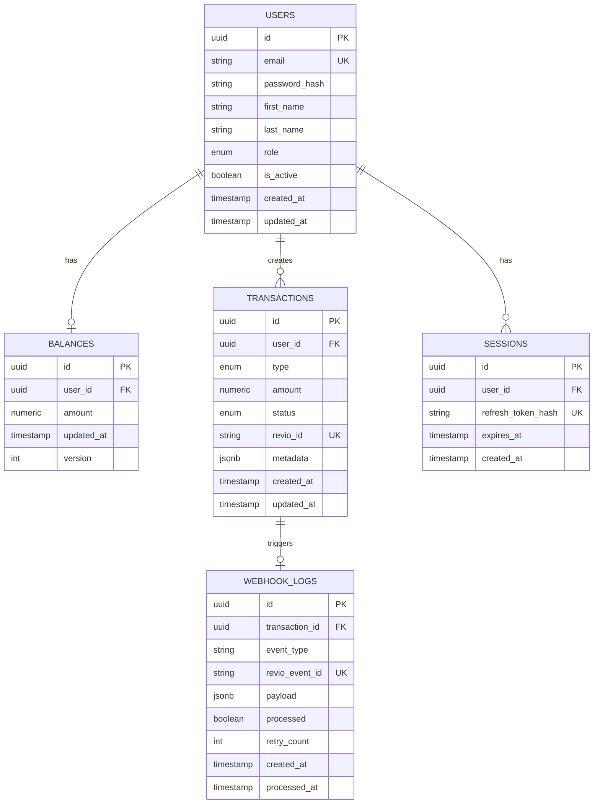

# Database Schema Design

## Overview
This document defines the database schema for the Octoco Quiz backend system, including table structures, relationships, indexes, constraints, and special PostgreSQL features used to ensure data integrity and performance.

---

## Database Technology

**Database**: PostgreSQL 16+

**Why PostgreSQL:**
- ACID compliance (critical for financial transactions)
- `NUMERIC` type for precise decimal arithmetic (no floating-point errors)
- MVCC (Multi-Version Concurrency Control) for high concurrency
- Advanced isolation levels (SERIALIZABLE)
- Row-level locking (SELECT FOR UPDATE)
- Rich indexing support (B-tree, Hash, GIN, GiST)
- JSON support for flexible data storage

---

## Entity Relationship Diagram



---

## Table Definitions

### 1. `users` Table

**Purpose**: Store user account information and credentials

| Column | Type | Constraints | Description |
|--------|------|-------------|-------------|
| `id` | UUID | PRIMARY KEY, DEFAULT gen_random_uuid() | Unique user identifier |
| `email` | VARCHAR(255) | UNIQUE, NOT NULL | User email (login identifier) |
| `password_hash` | VARCHAR(255) | NOT NULL | Bcrypt hashed password |
| `first_name` | VARCHAR(100) | NOT NULL | User's first name |
| `last_name` | VARCHAR(100) | NOT NULL | User's last name |
| `role` | ENUM ('user', 'admin') | NOT NULL, DEFAULT 'user' | User role for RBAC |
| `is_active` | BOOLEAN | NOT NULL, DEFAULT TRUE | Account active status |
| `created_at` | TIMESTAMP | NOT NULL, DEFAULT NOW() | Account creation timestamp |
| `updated_at` | TIMESTAMP | NOT NULL, DEFAULT NOW() | Last update timestamp |

**Indexes:**
- `PRIMARY KEY (id)` - B-tree index for fast lookups by ID
- `UNIQUE INDEX idx_users_email (email)` - Fast login lookups
- `INDEX idx_users_created_at (created_at DESC)` - Admin dashboard sorting

**Constraints:**
- Email validation via CHECK constraint: `email ~* '^[A-Za-z0-9._%+-]+@[A-Za-z0-9.-]+\.[A-Za-z]{2,}$'`
- Password hash must be bcrypt format (starts with `$2b$`)

---

### 2. `balances` Table

**Purpose**: Store user balances separately for optimized locking and updates

| Column | Type | Constraints | Description |
|--------|------|-------------|-------------|
| `id` | UUID | PRIMARY KEY, DEFAULT gen_random_uuid() | Unique balance record ID |
| `user_id` | UUID | FOREIGN KEY → users(id), UNIQUE, NOT NULL | One-to-one with users |
| `amount` | NUMERIC(12, 2) | NOT NULL, DEFAULT 0.00, CHECK (amount >= 0) | Current balance (2 decimal precision) |
| `updated_at` | TIMESTAMP | NOT NULL, DEFAULT NOW() | Last balance update |
| `version` | INTEGER | NOT NULL, DEFAULT 0 | Optimistic locking version (future use) |

**Indexes:**
- `PRIMARY KEY (id)` - Fast lookups
- `UNIQUE INDEX idx_balances_user_id (user_id)` - One balance per user, fast user→balance lookup

**Constraints:**
- `CHECK (amount >= 0)` - Prevent negative balances
- `FOREIGN KEY (user_id) REFERENCES users(id) ON DELETE CASCADE` - Delete balance when user deleted

**Design Decision: Separate Table**

**Why not store balance in `users` table?**
- ✅ **Lock granularity**: Lock only balance row, not entire user record
- ✅ **Query optimization**: Balance updates don't invalidate user cache
- ✅ **Audit trail**: Easier to track balance history separately
- ❌ **Extra JOIN**: Must join users + balances (acceptable tradeoff)

**Mitigation**: Cache balance in Redis with 5-minute TTL to reduce DB queries

---

### 3. `transactions` Table

**Purpose**: Immutable log of all deposits and withdrawals

| Column | Type | Constraints | Description |
|--------|------|-------------|-------------|
| `id` | UUID | PRIMARY KEY, DEFAULT gen_random_uuid() | Unique transaction ID |
| `user_id` | UUID | FOREIGN KEY → users(id), NOT NULL | Transaction owner |
| `type` | ENUM ('deposit', 'withdrawal') | NOT NULL | Transaction type |
| `amount` | NUMERIC(12, 2) | NOT NULL, CHECK (amount > 0) | Transaction amount |
| `status` | ENUM ('pending', 'processing', 'completed', 'failed', 'refunded') | NOT NULL | Transaction status |
| `revio_id` | VARCHAR(255) | UNIQUE, NULLABLE | Revio purchase/payout ID (NULL until created) |
| `metadata` | JSONB | NOT NULL, DEFAULT '{}' | Flexible data (bank details, error messages, etc.) |
| `created_at` | TIMESTAMP | NOT NULL, DEFAULT NOW() | Transaction initiation time |
| `updated_at` | TIMESTAMP | NOT NULL, DEFAULT NOW() | Last status update |

**Indexes:**
- `PRIMARY KEY (id)` - Fast lookups by transaction ID
- `INDEX idx_transactions_user_id (user_id, created_at DESC)` - User transaction history (covers most queries)
- `UNIQUE INDEX idx_transactions_revio_id (revio_id) WHERE revio_id IS NOT NULL` - Partial unique index (idempotency)
- `INDEX idx_transactions_status (status) WHERE status IN ('pending', 'processing')` - Monitor incomplete transactions
- `INDEX idx_transactions_created_at (created_at DESC)` - Admin dashboard sorting

**Constraints:**
- `CHECK (amount > 0)` - Positive amounts only (sign determined by `type`)
- `FOREIGN KEY (user_id) REFERENCES users(id) ON DELETE RESTRICT` - Prevent user deletion with transactions

**JSONB `metadata` Examples:**
```json
// Deposit metadata
{
  "checkout_url": "https://revio.com/checkout/abc123",
  "customer_ip": "192.168.1.1"
}

// Withdrawal metadata
{
  "bank_account": "****1234",
  "bank_name": "Chase",
  "payout_method": "ACH"
}

// Failed transaction metadata
{
  "error_code": "insufficient_funds",
  "error_message": "Payout failed: Insufficient balance"
}
```

---

### 4. `webhook_logs` Table

**Purpose**: Audit trail of all webhook events from Revio (idempotency + debugging)

| Column | Type | Constraints | Description |
|--------|------|-------------|-------------|
| `id` | UUID | PRIMARY KEY, DEFAULT gen_random_uuid() | Unique log entry ID |
| `transaction_id` | UUID | FOREIGN KEY → transactions(id), NULLABLE | Related transaction (NULL if no match) |
| `event_type` | VARCHAR(100) | NOT NULL | Revio event type (e.g., `purchase.paid`) |
| `revio_event_id` | VARCHAR(255) | UNIQUE, NOT NULL | Revio's unique event ID (idempotency key) |
| `payload` | JSONB | NOT NULL | Full webhook payload |
| `signature` | VARCHAR(500) | NOT NULL | RSA-SHA256 signature from Revio |
| `processed` | BOOLEAN | NOT NULL, DEFAULT FALSE | Processing status |
| `retry_count` | INTEGER | NOT NULL, DEFAULT 0 | Number of processing attempts |
| `error_message` | TEXT | NULLABLE | Error details if processing failed |
| `created_at` | TIMESTAMP | NOT NULL, DEFAULT NOW() | Webhook received timestamp |
| `processed_at` | TIMESTAMP | NULLABLE | Successfully processed timestamp |

**Indexes:**
- `PRIMARY KEY (id)` - Fast lookups
- `UNIQUE INDEX idx_webhook_logs_revio_event_id (revio_event_id)` - Prevent duplicate processing (idempotency)
- `INDEX idx_webhook_logs_processed (processed, created_at)` - Find unprocessed webhooks
- `INDEX idx_webhook_logs_transaction_id (transaction_id)` - Lookup webhooks for a transaction

**Constraints:**
- `FOREIGN KEY (transaction_id) REFERENCES transactions(id) ON DELETE SET NULL` - Keep log even if transaction deleted

**Idempotency Strategy:**
1. Receive webhook with `revio_event_id`
2. Try to INSERT into `webhook_logs` with `revio_event_id`
3. If UNIQUE constraint violation → webhook already processed, return 200 OK
4. If INSERT succeeds → process webhook, update balance, set `processed = TRUE`

---

### 5. `sessions` Table (Optional - JWT Refresh Token Storage)

**Purpose**: Track active refresh tokens for token revocation

| Column | Type | Constraints | Description |
|--------|------|-------------|-------------|
| `id` | UUID | PRIMARY KEY, DEFAULT gen_random_uuid() | Unique session ID |
| `user_id` | UUID | FOREIGN KEY → users(id), NOT NULL | Session owner |
| `refresh_token_hash` | VARCHAR(255) | UNIQUE, NOT NULL | Hashed refresh token (jti claim) |
| `expires_at` | TIMESTAMP | NOT NULL | Token expiration time |
| `created_at` | TIMESTAMP | NOT NULL, DEFAULT NOW() | Session creation time |

**Indexes:**
- `PRIMARY KEY (id)`
- `UNIQUE INDEX idx_sessions_refresh_token_hash (refresh_token_hash)` - Fast token validation
- `INDEX idx_sessions_user_id (user_id)` - List user sessions
- `INDEX idx_sessions_expires_at (expires_at)` - Cleanup expired sessions

**Constraints:**
- `FOREIGN KEY (user_id) REFERENCES users(id) ON DELETE CASCADE` - Delete sessions when user deleted

**Design Decision: Store Refresh Tokens?**

**Tradeoff:**
- ✅ **Revocation**: Can invalidate tokens before expiry (logout, password change)
- ✅ **Audit**: Track active sessions per user
- ❌ **Statefulness**: Adds DB dependency to auth (defeats JWT statelessness)

**Alternative**: Store in Redis instead of PostgreSQL (faster, auto-expiry with TTL)

**Recommendation**: Use Redis for sessions (better performance), fallback to PostgreSQL if Redis unavailable

---

## Special PostgreSQL Features

### 1. SERIALIZABLE Isolation Level

**Used for**: Balance updates and transaction creation

**Purpose**: Prevent race conditions and ensure consistency

**Example Scenario:**
```
User has $100 balance
Two concurrent withdrawals of $60 each

Without SERIALIZABLE:
- Both read balance = $100
- Both pass validation (100 >= 60)
- Both deduct $60
- Final balance = $100 - $60 - $60 = -$20 ❌ (negative balance!)

With SERIALIZABLE:
- Transaction 1: Read $100, validate, deduct $60, commit ($40 left)
- Transaction 2: Tries to commit, but serialization error detected
- Transaction 2: Retry, read $40, validate, fail (40 < 60) ✅
```

**Usage Pattern:**
```sql
BEGIN TRANSACTION ISOLATION LEVEL SERIALIZABLE;
SELECT amount FROM balances WHERE user_id = ? FOR UPDATE;
UPDATE balances SET amount = amount - ? WHERE user_id = ?;
COMMIT;
```

---

### 2. Row-Level Locking (SELECT FOR UPDATE)

**Used for**: Balance updates during transactions

**Purpose**: Pessimistic locking to prevent concurrent modifications

**How it works:**
- `SELECT ... FOR UPDATE` acquires exclusive lock on row
- Other transactions attempting to lock same row must wait
- Lock released on COMMIT or ROLLBACK

**Tradeoff:**
- ✅ **Guaranteed consistency**: No race conditions
- ❌ **Blocking**: Concurrent requests wait (acceptable for financial transactions)

---

### 3. Partial Unique Indexes

**Used for**: `transactions.revio_id` (only unique when NOT NULL)

```sql
CREATE UNIQUE INDEX idx_transactions_revio_id
ON transactions(revio_id)
WHERE revio_id IS NOT NULL;
```

**Why:**
- Transactions start with `revio_id = NULL` (pending Revio API call)
- After Revio responds, `revio_id` is populated
- Multiple NULL values allowed, but each non-NULL value must be unique

---

### 4. JSONB for Flexible Data

**Used for**: `transactions.metadata`, `webhook_logs.payload`

**Advantages:**
- Schema flexibility (different metadata per transaction type)
- Index JSON fields: `CREATE INDEX idx_transactions_metadata_error ON transactions USING GIN (metadata)`
- Query JSON: `SELECT * FROM transactions WHERE metadata->>'error_code' = 'insufficient_funds'`

**Disadvantages:**
- Less type safety (mitigated with application validation)
- Harder to enforce constraints

---

### 5. Automatic Timestamps with Triggers

**Pattern**: `updated_at` columns automatically updated

```sql
CREATE OR REPLACE FUNCTION update_updated_at_column()
RETURNS TRIGGER AS $$
BEGIN
    NEW.updated_at = NOW();
    RETURN NEW;
END;
$$ LANGUAGE plpgsql;

CREATE TRIGGER update_users_updated_at
BEFORE UPDATE ON users
FOR EACH ROW
EXECUTE FUNCTION update_updated_at_column();
```

**Applied to**: `users`, `balances`, `transactions`

---

## Data Integrity Constraints

### Foreign Key Cascade Rules

| Table | Foreign Key | ON DELETE | Justification |
|-------|-------------|-----------|---------------|
| `balances` → `users` | user_id | CASCADE | Balance has no meaning without user |
| `transactions` → `users` | user_id | RESTRICT | Preserve transaction history, prevent user deletion |
| `sessions` → `users` | user_id | CASCADE | Sessions invalid when user deleted |
| `webhook_logs` → `transactions` | transaction_id | SET NULL | Keep webhook log for audit, even if transaction deleted |

### Check Constraints

| Table | Constraint | Purpose |
|-------|-----------|---------|
| `balances` | `amount >= 0` | Prevent negative balances |
| `transactions` | `amount > 0` | Ensure positive transaction amounts |
| `users` | `email ~* '^[A-Za-z0-9._%+-]+@...'` | Valid email format |

---

## Query Optimization Strategy

### Covering Indexes

**Problem**: Fetching user transaction history requires multiple columns

**Solution**: Composite index covering common query

```sql
CREATE INDEX idx_transactions_user_id_covering
ON transactions(user_id, created_at DESC)
INCLUDE (type, amount, status);
```

**Benefit**: Index-only scan (no table access needed) for:
```sql
SELECT type, amount, status, created_at
FROM transactions
WHERE user_id = ?
ORDER BY created_at DESC
LIMIT 20;
```

---

### Index Selection Guidelines

| Query Pattern | Index Type | Example |
|---------------|-----------|---------|
| Exact match (PK, FK) | B-tree (default) | `WHERE user_id = ?` |
| Range queries | B-tree | `WHERE created_at > ?` |
| Full-text search | GIN | `WHERE metadata @> '{"status":"failed"}'` |
| Partial matching | GIN/GiST | `WHERE email LIKE '%@example.com'` |

---

## Scaling Considerations

### Read Replicas

**When**: 10K+ users

**Strategy:**
- Route read-only queries (transaction history, balance checks) to replicas
- Route write queries (deposits, withdrawals) to primary
- Use Django database router to split traffic

**Django Configuration:**
```python
DATABASES = {
    'default': {  # Primary (writes)
        'ENGINE': 'django.db.backends.postgresql',
        'HOST': 'primary.db.railway.app',
    },
    'replica': {  # Read replica (reads)
        'ENGINE': 'django.db.backends.postgresql',
        'HOST': 'replica.db.railway.app',
    }
}
```

---

### Partitioning

**When**: 100K+ transactions

**Strategy**: Partition `transactions` table by date (monthly)

```sql
CREATE TABLE transactions_2025_01
PARTITION OF transactions
FOR VALUES FROM ('2025-01-01') TO ('2025-02-01');
```

**Benefits:**
- Faster queries (scan only relevant partitions)
- Easier archival (detach old partitions)

---

### Connection Pooling

**Tool**: PgBouncer (Railway includes this)

**Why:**
- PostgreSQL has connection limit (~100 default)
- Each Django request needs a connection
- Connection creation is expensive

**Configuration:**
- Pool size: 20 connections per instance
- Mode: Transaction pooling (connection reused after COMMIT)

---

## Backup & Recovery Strategy

### Automated Backups

**Provider**: Railway PostgreSQL (built-in)

**Schedule:**
- Full backup: Daily at 2 AM UTC
- Retention: 7 days (free tier), 35 days (production)
- Point-in-time recovery (PITR): Within retention window

**Testing:**
- Monthly backup restore test
- Verify data integrity after restore

---

### Disaster Recovery Plan

**RTO (Recovery Time Objective)**: 1 hour
**RPO (Recovery Point Objective)**: 5 minutes

**Procedure:**
1. Detect failure (monitoring alerts)
2. Promote read replica to primary (if using replicas)
3. Restore from latest backup
4. Update DNS/connection strings
5. Verify application functionality

---

## Migration Strategy

**Tool**: Django Migrations

**Best Practices:**
1. **Backward compatible migrations**: Add columns as nullable first, backfill, then set NOT NULL
2. **Zero-downtime deployments**: Use `ADD COLUMN IF NOT EXISTS`, `CREATE INDEX CONCURRENTLY`
3. **Test migrations on staging**: Always test with production-like data size
4. **Rollback plan**: Keep migration reversible (implement `reverse()` method)

**Example: Adding `phone_number` to users**

```python
# Migration 1: Add nullable column
operations = [
    migrations.AddField(
        model_name='user',
        name='phone_number',
        field=models.CharField(max_length=20, null=True),
    ),
]

# Migration 2 (later): Make it required
operations = [
    # Backfill data first (data migration)
    migrations.RunPython(backfill_phone_numbers),
    # Then set NOT NULL
    migrations.AlterField(
        model_name='user',
        name='phone_number',
        field=models.CharField(max_length=20, null=False),
    ),
]
```

---

## Summary

**Tables**: 5 core tables (users, balances, transactions, webhook_logs, sessions)

**Key Features:**
- SERIALIZABLE isolation for financial consistency
- Row-level locking (SELECT FOR UPDATE) to prevent race conditions
- Partial unique indexes for idempotency
- JSONB for flexible metadata storage
- Comprehensive indexes for query performance

**Data Integrity:**
- Foreign key constraints with appropriate cascade rules
- Check constraints for business rules (non-negative balances)
- Unique constraints for idempotency (email, revio_id, revio_event_id)

**Scaling Path:**
- Read replicas for horizontal scaling
- Connection pooling (PgBouncer)
- Table partitioning for large datasets
- Covering indexes for common queries

**Tradeoffs Made:**
- Separate `balances` table (better locking) vs. embedded in `users` (simpler schema)
- Pessimistic locking (guaranteed consistency) vs. optimistic locking (better concurrency)
- JSONB flexibility (schema changes) vs. strict columns (type safety)
