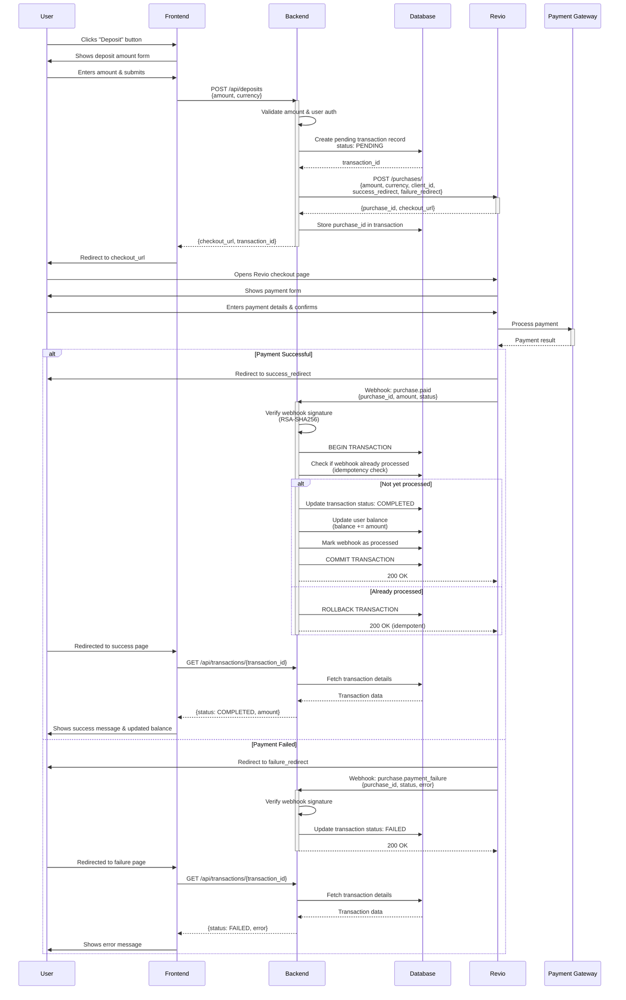

# Deposit Flow

## Overview
This diagram shows the complete flow for a user depositing funds into their account using Revio Pay.

## Sequence Diagram



## Flow Steps Explained

### 1. User Initiates Deposit
- User clicks deposit button and enters desired amount
- Frontend sends request to backend with amount and currency

### 2. Backend Creates Transaction
- Backend validates the request and user authentication
- Creates a pending transaction record in the database
- Calls Revio API to create a purchase

### 3. Revio Purchase Creation
- Revio creates a purchase and returns:
  - `purchase_id`: Unique identifier for this purchase
  - `checkout_url`: Hosted payment page URL
- Backend stores the `purchase_id` linked to the transaction

### 4. User Payment Process
- User is redirected to Revio's hosted checkout page
- User selects payment method and completes payment
- Revio processes payment through appropriate gateway

### 5. Webhook Processing (Asynchronous)
- Revio sends webhook to backend (either `purchase.paid` or `purchase.payment_failure`)
- Backend verifies webhook signature using RSA-SHA256
- Backend implements idempotency check to prevent duplicate processing
- If payment successful:
  - Updates transaction status to COMPLETED
  - Updates user balance (atomic operation)
  - Marks webhook as processed

### 6. User Confirmation
- User redirected back to application (success or failure page)
- Frontend queries backend for final transaction status
- User sees updated balance and confirmation message

## Key Design Considerations

### Idempotency
- Webhooks may be retried by Revio (exponential backoff up to 36 hours)
- Backend must check if webhook already processed before updating balance
- Use unique webhook delivery ID or purchase ID to track processing

### Concurrency Safety
- Use database transactions (BEGIN/COMMIT/ROLLBACK)
- Consider using pessimistic locking on user balance row
- Ensure atomic balance updates

### Security
- Verify webhook signature on every incoming webhook
- Use HTTPS for all communications
- Validate user authentication before creating deposits
- Store API keys securely (environment variables, secret manager)

### Failure Handling
- Handle network timeouts when calling Revio API
- Implement retry logic with exponential backoff
- Handle case where webhook arrives before user redirect
- Handle case where webhook never arrives (manual reconciliation)

### Transaction States
- **PENDING**: Transaction created, awaiting payment
- **COMPLETED**: Payment successful, balance updated
- **FAILED**: Payment failed or cancelled
- **EXPIRED**: Payment window expired (optional)

## Alternative Flow: Polling (Backup)

If webhook is delayed or fails, frontend can poll backend:

```
Frontend --(every 5s)--> Backend: GET /api/transactions/{id}
Backend --> Revio: GET /purchases/{purchase_id}
Revio --> Backend: {status: paid}
Backend --> Database: Update transaction & balance
Backend --> Frontend: {status: COMPLETED}
```

This provides redundancy if webhooks fail, but webhooks should be primary mechanism.
