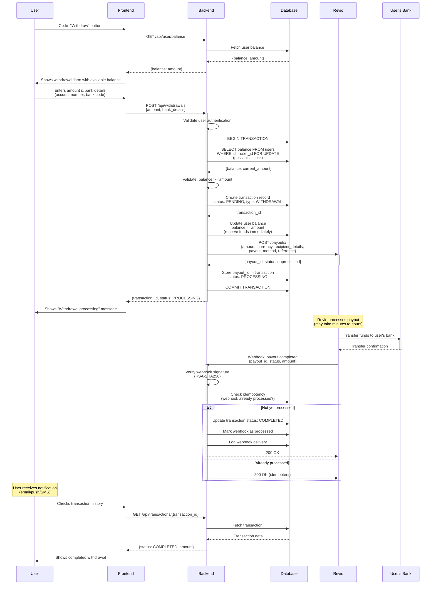

# Withdrawal Flow

## Overview
This diagram shows the complete flow for a user withdrawing funds from their account using Revio Pay.

## Sequence Diagram



## Error Handling

### Insufficient Balance
If the user doesn't have sufficient balance, the transaction is rolled back before calling Revio, and an error is returned immediately.

### Immediate Payout Rejection
If Revio rejects the payout request (e.g., invalid bank details format, API error), the backend:
- Refunds the reserved balance
- Updates transaction status to FAILED
- Returns error message to user

### Payout Failure After Processing
If the payout is accepted but fails later during bank transfer (e.g., invalid account number, closed account), Revio sends a `payout.failed` webhook. The backend:
- Updates transaction status to FAILED
- Refunds the reserved amount to user balance
- Notifies user and alerts admin for investigation

**See Section 8 (Failure Handling) for detailed failure scenarios and recovery procedures.**

## Flow Steps Explained

### 1. User Initiates Withdrawal
- User clicks withdraw button
- Frontend fetches and displays current balance
- User enters withdrawal amount and bank details

### 2. Backend Validates & Reserves Funds
- Backend validates user authentication
- Begins database transaction with pessimistic lock on balance
- Checks if user has sufficient balance
- **Immediately deducts amount from balance** (reserves funds)
- Creates pending withdrawal transaction

### 3. Backend Creates Payout with Revio
- Calls Revio API to create payout
- Sends recipient bank details and amount
- Receives `payout_id` if successful

### 4. Revio Processes Payout
- Revio initiates bank transfer asynchronously
- Processing time varies (minutes to hours depending on bank)
- Revio sends funds to user's bank account

### 5. Completion Webhook Processing
- Revio sends `payout.completed` webhook when transfer succeeds
- Backend verifies webhook signature (RSA-SHA256)
- Updates transaction status to COMPLETED
- Implements idempotency check to handle webhook retries safely

### 6. User Confirmation
- User receives notification (email/SMS/push)
- User can check transaction history
- Transaction shows as completed or failed

## Key Design Considerations

### Balance Reservation
- **Critical**: Deduct balance IMMEDIATELY when creating withdrawal
- This prevents user from withdrawing more than they have
- If payout fails, refund the amount back to balance
- Use pessimistic locking to prevent race conditions

### Concurrency Safety
```sql
BEGIN TRANSACTION;
SELECT balance FROM users WHERE id = ? FOR UPDATE;  -- Lock row
-- Validate balance >= amount
UPDATE users SET balance = balance - ? WHERE id = ?;
-- Create withdrawal transaction
COMMIT;
```

### Idempotency
- Webhooks may be retried
- Check if webhook already processed using:
  - Webhook delivery ID
  - Payout ID + event type combination
- Never refund balance twice

### Security
- Verify webhook signatures (RSA-SHA256)
- Validate user owns the bank account (via verification flow)
- Rate limit withdrawal attempts
- Implement daily/monthly withdrawal limits
- Require 2FA for large withdrawals (optional)

### Bank Details Verification
Consider implementing bank account verification before allowing withdrawals:
1. User adds bank account
2. Send micro-deposit (small amount like 1 cent)
3. User confirms amount received
4. Mark account as verified
5. Only allow withdrawals to verified accounts

### Transaction States
- **PENDING**: Initial state, validating request
- **PROCESSING**: Payout created with Revio, funds reserved
- **COMPLETED**: Payout successful, funds transferred
- **FAILED**: Payout failed, funds refunded to balance
- **CANCELLED**: User or admin cancelled (before processing)

### Failure Recovery

If payout fails at any stage, the reserved balance is automatically refunded. For detailed failure scenarios including:
- API timeouts and Revio downtime
- Bank rejections and invalid accounts
- Missing webhooks and reconciliation
- Concurrent withdrawal attempts

**See Section 8: Failure Handling & Recovery Design**

### Compliance & Fraud Prevention
- Log all withdrawal attempts (successful and failed)
- Monitor for suspicious patterns:
  - Multiple withdrawals to different accounts
  - Withdrawals immediately after deposits
  - Unusual amounts or frequencies
- Implement velocity checks (max N withdrawals per hour)
- Consider manual review for first withdrawal or large amounts

### Reconciliation
Implement daily reconciliation job:
1. Fetch all completed payouts from Revio for previous day
2. Compare with internal transaction records
3. Identify discrepancies
4. Alert admin for manual review

### User Experience Enhancements
- Show estimated processing time (e.g., "1-2 business days")
- Send status update notifications:
  - "Withdrawal processing"
  - "Withdrawal completed"
  - "Withdrawal failed - funds returned"
- Allow users to view payout status in real-time
- Provide clear error messages (invalid bank details, insufficient balance)

## Alternative Flow: Instant Withdrawals (Advanced)

For instant withdrawals (if Revio supports):
1. Use tokenized bank accounts
2. Charge premium fee for instant processing
3. Process via faster payment rails
4. Update transaction status immediately after Revio confirmation
