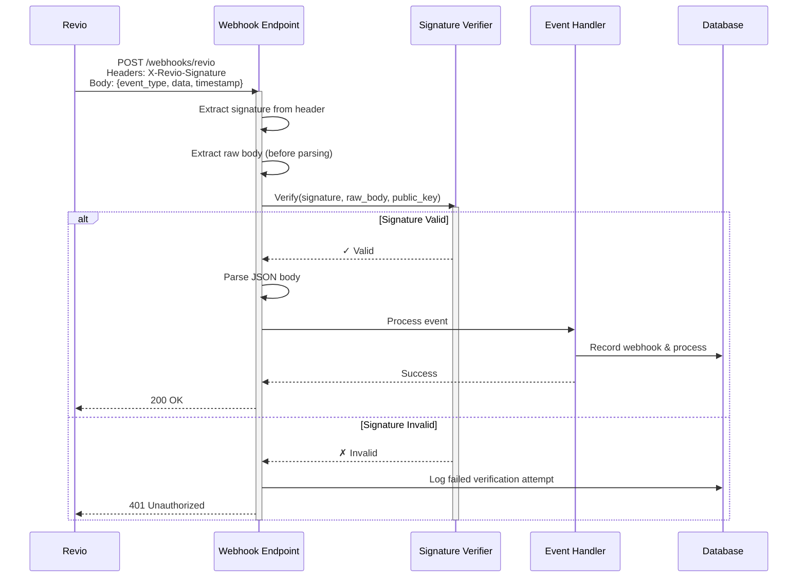
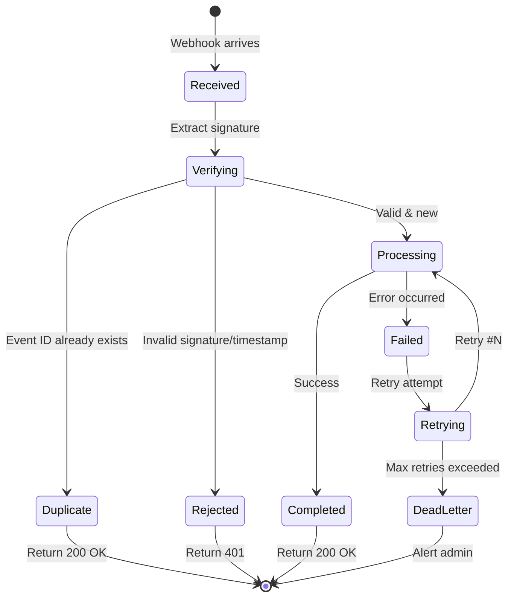

# Webhook Handling Design

## Overview
This document details the design for securely receiving, verifying, processing, and auditing webhooks from Revio. Webhooks are critical for maintaining data consistency between our system and Revio's payment processing state.

---

## Webhook Signature Verification

### Signature Algorithm
**Method**: RSA-SHA256 digital signature

Revio signs each webhook payload with their private key. Our backend verifies the signature using Revio's public key.

### Verification Flow



### Implementation Strategy

#### 1. Extract Signature from Headers
```python
# Revio sends signature in HTTP header
X-Revio-Signature: sha256=<base64_encoded_signature>
X-Revio-Timestamp: 1234567890
X-Revio-Event-ID: evt_abc123xyz
```

#### 2. Construct Signed Payload
The signature is computed over a canonical string:
```
{timestamp}.{event_id}.{raw_json_body}
```

Example:
```
1234567890.evt_abc123xyz.{"event_type":"purchase.paid","data":{...}}
```

#### 3. Verify Signature
```python
from cryptography.hazmat.primitives import hashes, serialization
from cryptography.hazmat.primitives.asymmetric import padding
import base64

def verify_revio_webhook(signature_header, timestamp, event_id, raw_body, public_key_pem):
    """
    Verify RSA-SHA256 signature from Revio webhook.

    Args:
        signature_header: Base64-encoded signature from X-Revio-Signature header
        timestamp: Timestamp from X-Revio-Timestamp header
        event_id: Event ID from X-Revio-Event-ID header
        raw_body: Raw JSON body as bytes (BEFORE parsing)
        public_key_pem: Revio's RSA public key in PEM format

    Returns:
        bool: True if signature is valid, False otherwise
    """
    # Parse signature (format: "sha256=<base64_signature>")
    signature_b64 = signature_header.split('=')[1]
    signature_bytes = base64.b64decode(signature_b64)

    # Construct signed payload
    signed_payload = f"{timestamp}.{event_id}.{raw_body.decode('utf-8')}"

    # Load public key
    public_key = serialization.load_pem_public_key(public_key_pem.encode())

    # Verify signature
    try:
        public_key.verify(
            signature_bytes,
            signed_payload.encode('utf-8'),
            padding.PKCS1v15(),
            hashes.SHA256()
        )
        return True
    except Exception:
        return False
```

#### 4. Critical Implementation Details

**MUST use raw body bytes:**
```python
# ✅ CORRECT: Capture raw body before parsing
@app.route('/webhooks/revio', methods=['POST'])
def handle_webhook():
    raw_body = request.get_data()  # Get raw bytes
    signature = request.headers.get('X-Revio-Signature')

    # Verify signature FIRST
    if not verify_signature(signature, raw_body):
        return jsonify({'error': 'Invalid signature'}), 401

    # THEN parse JSON
    data = json.loads(raw_body)
    # ... process event

# ❌ WRONG: Parsing JSON changes whitespace/ordering
@app.route('/webhooks/revio', methods=['POST'])
def handle_webhook_wrong():
    data = request.get_json()  # Already parsed!
    raw_body = json.dumps(data)  # Won't match original
    # Signature verification will fail!
```

---

## Trust Validation

### Multi-Layer Validation

#### Layer 1: Signature Verification (Required)
- Verify RSA-SHA256 signature with Revio's public key
- Reject all requests with invalid signatures
- **Status**: MUST implement

#### Layer 2: Timestamp Validation (Required)
Prevent replay attacks by rejecting old webhooks.

```python
import time

MAX_TIMESTAMP_AGE_SECONDS = 300  # 5 minutes

def validate_timestamp(timestamp_str):
    """
    Ensure webhook timestamp is recent (within 5 minutes).

    Prevents replay attacks using captured webhooks.
    """
    try:
        webhook_time = int(timestamp_str)
        current_time = int(time.time())
        age = current_time - webhook_time

        # Reject if too old
        if age > MAX_TIMESTAMP_AGE_SECONDS:
            return False, f"Webhook too old: {age}s (max {MAX_TIMESTAMP_AGE_SECONDS}s)"

        # Reject if timestamp is in future (clock skew tolerance: 60s)
        if age < -60:
            return False, f"Webhook timestamp in future: {-age}s"

        return True, None
    except (ValueError, TypeError):
        return False, "Invalid timestamp format"
```

#### Layer 3: Event ID Deduplication (Required)
Prevent processing the same webhook multiple times.

```python
def is_duplicate_webhook(event_id):
    """
    Check if webhook with this event_id already processed.

    Uses webhook_logs table with UNIQUE constraint on revio_event_id.
    """
    # Attempt to insert into webhook_logs
    try:
        # This will fail if event_id already exists (UNIQUE constraint)
        webhook_log = WebhookLog.objects.create(
            revio_event_id=event_id,
            # ... other fields
        )
        return False  # Not a duplicate
    except IntegrityError:
        # UNIQUE constraint violation = already processed
        return True  # Duplicate detected
```

**Database-backed idempotency** (uses `webhook_logs` table from Section 3):
```sql
-- Unique constraint prevents duplicate processing
CREATE UNIQUE INDEX idx_webhook_logs_revio_event_id
ON webhook_logs(revio_event_id);

-- Insertion pattern
BEGIN;
INSERT INTO webhook_logs (revio_event_id, event_type, payload, ...)
VALUES ('evt_abc123', 'purchase.paid', '{...}', ...);
-- If this succeeds, webhook is new → process it
-- If this fails (UNIQUE violation), webhook already processed → return 200 OK
COMMIT;
```

#### Layer 4: Source IP Validation (Optional, for defense-in-depth)
```python
REVIO_WEBHOOK_IP_RANGES = [
    '192.0.2.0/24',      # Example: Revio's IP range (get from Revio docs)
    '198.51.100.0/24',   # Example: Revio's backup IP range
]

def validate_source_ip(request_ip):
    """
    Optional: Verify webhook comes from Revio's known IP ranges.

    NOTE: Should NOT be primary security mechanism (IPs can be spoofed in some contexts).
    Use as additional defense layer only.
    """
    from ipaddress import ip_address, ip_network

    client_ip = ip_address(request_ip)
    for ip_range in REVIO_WEBHOOK_IP_RANGES:
        if client_ip in ip_network(ip_range):
            return True
    return False
```

**Decision**: Implement Layers 1-3 (required). Layer 4 is optional defense-in-depth.

---

## Protection Against Attacks

### Attack Vector 1: Spoofed Webhooks

**Attack**: Attacker sends fake webhook to credit their account
```http
POST /webhooks/revio HTTP/1.1
X-Revio-Signature: fake_signature
Content-Type: application/json

{
  "event_type": "purchase.paid",
  "data": {
    "purchase_id": "fake_purchase_123",
    "amount": 1000000,
    "user_id": "attacker_id"
  }
}
```

**Defense**:
1. ✅ **Signature verification rejects** (attacker doesn't have Revio's private key)
2. ✅ **Purchase ID validation** (backend checks if purchase exists in database)
3. ✅ **User ID verification** (purchase must belong to authenticated user)

### Attack Vector 2: Replay Attacks

**Attack**: Attacker captures valid webhook and replays it multiple times
```
1. Legitimate webhook: "purchase.paid, amount: 100"
2. Attacker intercepts webhook
3. Attacker replays webhook 100 times → tries to credit $10,000
```

**Defense**:
1. ✅ **Timestamp validation** (webhook older than 5 min rejected)
2. ✅ **Event ID deduplication** (each event_id processed only once)
3. ✅ **Database idempotency** (UNIQUE constraint on revio_event_id)

### Attack Vector 3: Man-in-the-Middle (MITM)

**Attack**: Attacker intercepts webhook in transit and modifies payload

**Defense**:
1. ✅ **HTTPS/TLS required** (encrypt in transit)
2. ✅ **Signature verification** (any modification breaks signature)
3. ✅ **Certificate validation** (backend validates Revio's TLS certificate)

### Attack Vector 4: Timing Attacks on Signature Verification

**Attack**: Attacker uses timing differences to guess signature

**Defense**:
```python
import hmac

def constant_time_compare(a, b):
    """
    Compare two strings in constant time to prevent timing attacks.
    """
    return hmac.compare_digest(a, b)

# Use for signature comparison
if constant_time_compare(expected_signature, provided_signature):
    # Valid
else:
    # Invalid
```

---

## Webhook Logging & Auditing

### Database Schema Reference

Uses `webhook_logs` table from Section 3 (Database Schema):

```sql
CREATE TABLE webhook_logs (
    id UUID PRIMARY KEY DEFAULT gen_random_uuid(),
    transaction_id UUID NULL REFERENCES transactions(id) ON DELETE SET NULL,
    event_type VARCHAR(100) NOT NULL,
    revio_event_id VARCHAR(255) UNIQUE NOT NULL,
    payload JSONB NOT NULL,
    signature VARCHAR(500) NOT NULL,
    processed BOOLEAN NOT NULL DEFAULT FALSE,
    retry_count INTEGER NOT NULL DEFAULT 0,
    error_message TEXT NULL,
    created_at TIMESTAMP NOT NULL DEFAULT NOW(),
    processed_at TIMESTAMP NULL
);

-- Indexes
CREATE UNIQUE INDEX idx_webhook_logs_revio_event_id ON webhook_logs(revio_event_id);
CREATE INDEX idx_webhook_logs_processed ON webhook_logs(processed, created_at);
CREATE INDEX idx_webhook_logs_transaction_id ON webhook_logs(transaction_id);
```

### What to Log

#### For Every Webhook (Success or Failure)
```python
webhook_log = {
    'revio_event_id': 'evt_abc123',           # Revio's unique event ID
    'event_type': 'purchase.paid',             # Event type
    'payload': {...},                          # Full JSON payload (JSONB)
    'signature': 'sha256=...',                 # Signature for audit
    'source_ip': '192.0.2.100',                # Request IP (not in table, log separately)
    'created_at': '2025-01-15T10:30:00Z',      # When webhook received
    'processed': False,                        # Processing status
    'transaction_id': None,                    # Linked transaction (if applicable)
}
```

#### After Processing
```python
# Update webhook_log record
webhook_log.update({
    'processed': True,
    'processed_at': '2025-01-15T10:30:02Z',
    'transaction_id': 'uuid-of-transaction',
    'error_message': None,  # Or error details if failed
})
```

#### If Processing Fails
```python
webhook_log.update({
    'processed': False,
    'retry_count': 1,
    'error_message': 'Database timeout during balance update',
})
```

### Audit Trail Queries

#### Query 1: Find all webhooks for a transaction
```sql
SELECT
    event_type,
    created_at,
    processed,
    error_message
FROM webhook_logs
WHERE transaction_id = 'uuid-of-transaction'
ORDER BY created_at DESC;
```

#### Query 2: Find unprocessed webhooks (for retry)
```sql
SELECT *
FROM webhook_logs
WHERE processed = FALSE
  AND retry_count < 3
  AND created_at > NOW() - INTERVAL '24 hours'
ORDER BY created_at ASC;
```

#### Query 3: Find duplicate webhook attempts
```sql
SELECT
    revio_event_id,
    COUNT(*) as attempt_count,
    MIN(created_at) as first_attempt,
    MAX(created_at) as last_attempt
FROM webhook_logs
GROUP BY revio_event_id
HAVING COUNT(*) > 1;
```

#### Query 4: Webhook failure rate by event type
```sql
SELECT
    event_type,
    COUNT(*) as total,
    SUM(CASE WHEN processed = TRUE THEN 1 ELSE 0 END) as successful,
    SUM(CASE WHEN processed = FALSE THEN 1 ELSE 0 END) as failed,
    ROUND(100.0 * SUM(CASE WHEN processed = FALSE THEN 1 ELSE 0 END) / COUNT(*), 2) as failure_rate_pct
FROM webhook_logs
WHERE created_at > NOW() - INTERVAL '7 days'
GROUP BY event_type;
```

---

## Processing Status Tracking

### Webhook Processing States



### State Transitions

| Current State | Event | Next State | Action |
|--------------|-------|------------|--------|
| - | Webhook received | Received | Log raw webhook |
| Received | Signature valid | Verifying | Check timestamp |
| Received | Signature invalid | Rejected | Log failure, return 401 |
| Verifying | Timestamp valid | Processing | Check event_id |
| Verifying | Timestamp invalid | Rejected | Log replay attempt |
| Verifying | Event ID exists | Duplicate | Return 200 OK (idempotent) |
| Processing | Balance updated | Completed | Mark processed=true |
| Processing | Exception thrown | Failed | Log error, increment retry_count |
| Failed | retry_count < 3 | Retrying | Queue for retry |
| Failed | retry_count >= 3 | DeadLetter | Alert admin, manual review |

### Processing Workflow

```python
from django.db import transaction
from django.core.exceptions import ValidationError
import logging

logger = logging.getLogger(__name__)

@transaction.atomic
def process_webhook(request):
    """
    Main webhook processing handler.
    """
    # Step 1: Extract raw data
    raw_body = request.body
    signature = request.headers.get('X-Revio-Signature')
    timestamp = request.headers.get('X-Revio-Timestamp')
    event_id = request.headers.get('X-Revio-Event-ID')

    # Step 2: Verify signature
    if not verify_signature(signature, timestamp, event_id, raw_body):
        logger.warning(f"Invalid webhook signature: {event_id}")
        WebhookLog.objects.create(
            revio_event_id=event_id or 'unknown',
            event_type='verification_failed',
            payload={'error': 'Invalid signature'},
            signature=signature or '',
            processed=False,
            error_message='Signature verification failed'
        )
        return JsonResponse({'error': 'Invalid signature'}, status=401)

    # Step 3: Validate timestamp (prevent replay)
    is_valid, error = validate_timestamp(timestamp)
    if not is_valid:
        logger.warning(f"Invalid timestamp: {event_id} - {error}")
        return JsonResponse({'error': error}, status=401)

    # Step 4: Parse payload
    try:
        payload = json.loads(raw_body)
    except json.JSONDecodeError:
        return JsonResponse({'error': 'Invalid JSON'}, status=400)

    event_type = payload.get('event_type')

    # Step 5: Check for duplicate (idempotency)
    try:
        webhook_log = WebhookLog.objects.create(
            revio_event_id=event_id,
            event_type=event_type,
            payload=payload,
            signature=signature,
            processed=False
        )
    except IntegrityError:
        # Duplicate event_id - already processed
        logger.info(f"Duplicate webhook ignored: {event_id}")
        return JsonResponse({'status': 'ok', 'message': 'Already processed'}, status=200)

    # Step 6: Process event asynchronously (Celery task)
    from .tasks import process_webhook_event
    process_webhook_event.delay(webhook_log.id)

    # Step 7: Return 200 OK immediately (don't block Revio)
    return JsonResponse({'status': 'ok', 'message': 'Webhook received'}, status=200)


# Celery task for async processing
@shared_task(bind=True, max_retries=3)
def process_webhook_event(self, webhook_log_id):
    """
    Process webhook event asynchronously.
    """
    webhook_log = WebhookLog.objects.get(id=webhook_log_id)
    event_type = webhook_log.event_type
    payload = webhook_log.payload

    try:
        # Route to appropriate handler
        if event_type == 'purchase.paid':
            handle_purchase_paid(webhook_log, payload)
        elif event_type == 'purchase.payment_failure':
            handle_purchase_failed(webhook_log, payload)
        elif event_type == 'payout.completed':
            handle_payout_completed(webhook_log, payload)
        elif event_type == 'payout.failed':
            handle_payout_failed(webhook_log, payload)
        else:
            raise ValueError(f"Unknown event type: {event_type}")

        # Mark as processed
        webhook_log.processed = True
        webhook_log.processed_at = timezone.now()
        webhook_log.save()

    except Exception as exc:
        # Log error
        webhook_log.retry_count += 1
        webhook_log.error_message = str(exc)
        webhook_log.save()

        # Retry with exponential backoff
        if webhook_log.retry_count < 3:
            logger.warning(f"Webhook processing failed, retrying: {webhook_log.id}")
            raise self.retry(exc=exc, countdown=60 * (2 ** webhook_log.retry_count))
        else:
            logger.error(f"Webhook processing failed permanently: {webhook_log.id}")
            # Send alert to admin
            send_alert_to_admin(webhook_log)
```

---

## Retry Strategy

### Revio's Retry Behavior
Revio retries failed webhooks with exponential backoff:
- Immediate
- 1 minute
- 5 minutes
- 15 minutes
- 1 hour
- 6 hours
- 24 hours
- Total: Up to 36 hours

### Our Processing Retry Strategy

**Return 200 OK immediately** to Revio after validation, even if processing hasn't completed. Process asynchronously.

```python
# ✅ CORRECT: Fast response, async processing
@app.route('/webhooks/revio', methods=['POST'])
def webhook_handler():
    # 1. Verify signature (fast)
    # 2. Check duplicate (fast - DB lookup)
    # 3. Log webhook (fast - DB insert)
    # 4. Queue for async processing (fast - Redis queue)
    # 5. Return 200 OK (< 1 second total)

    queue_for_processing(webhook_data)
    return {'status': 'ok'}, 200

# ❌ WRONG: Slow response, blocks Revio
@app.route('/webhooks/revio', methods=['POST'])
def webhook_handler_slow():
    verify_signature()
    update_balance()       # Slow - DB transaction
    send_email()          # Slow - external API
    update_analytics()    # Slow - external service
    return {'status': 'ok'}, 200  # Takes 5+ seconds!
```

### Internal Retry for Failed Processing

If async processing fails, retry with exponential backoff:

```python
# Celery task with automatic retry
@shared_task(bind=True, max_retries=3, default_retry_delay=60)
def process_webhook_event(self, webhook_log_id):
    try:
        # Process webhook
        handle_webhook(webhook_log_id)
    except (DatabaseError, ExternalAPIError) as exc:
        # Retry with exponential backoff
        # Retry 1: 60s delay
        # Retry 2: 120s delay (60 * 2^1)
        # Retry 3: 240s delay (60 * 2^2)
        raise self.retry(
            exc=exc,
            countdown=60 * (2 ** self.request.retries)
        )
```

---

## Event Type Handling

### Supported Events

| Event Type | Description | Handler Function | Critical? |
|-----------|-------------|------------------|-----------|
| `purchase.paid` | Deposit completed successfully | `handle_purchase_paid()` | ✅ Yes |
| `purchase.payment_failure` | Deposit failed | `handle_purchase_failed()` | ⚠️ Medium |
| `purchase.expired` | Payment window expired | `handle_purchase_expired()` | ⚠️ Medium |
| `payout.completed` | Withdrawal completed | `handle_payout_completed()` | ✅ Yes |
| `payout.failed` | Withdrawal failed | `handle_payout_failed()` | ✅ Yes |
| `payout.processing` | Withdrawal in progress | `handle_payout_processing()` | ℹ️ Low |

### Event Handler Pattern

```python
def handle_purchase_paid(webhook_log, payload):
    """
    Handle successful deposit.
    """
    purchase_id = payload['data']['purchase_id']
    amount = Decimal(payload['data']['amount'])

    # Find transaction by purchase_id
    try:
        txn = Transaction.objects.select_for_update().get(
            revio_id=purchase_id,
            type='deposit'
        )
    except Transaction.DoesNotExist:
        raise ValueError(f"Transaction not found: {purchase_id}")

    # Verify transaction not already completed
    if txn.status == 'completed':
        logger.info(f"Transaction already completed: {txn.id}")
        return  # Idempotent

    # Update balance and transaction atomically
    with transaction.atomic():
        # Lock user's balance row
        balance = Balance.objects.select_for_update().get(user_id=txn.user_id)

        # Update balance
        balance.amount += amount
        balance.save()

        # Update transaction status
        txn.status = 'completed'
        txn.save()

        # Link webhook to transaction
        webhook_log.transaction_id = txn.id
        webhook_log.save()

    logger.info(f"Deposit completed: user={txn.user_id}, amount={amount}")
```

---

## Monitoring & Alerting

### Metrics to Track

1. **Webhook volume** (webhooks/hour)
2. **Processing latency** (time from receipt to completion)
3. **Failure rate** (% of webhooks that fail processing)
4. **Duplicate rate** (% of webhooks that are duplicates)
5. **Retry rate** (% requiring retries)

### Alerts to Configure

| Alert | Condition | Severity | Action |
|-------|-----------|----------|--------|
| High failure rate | > 5% webhooks failing | High | Page on-call engineer |
| Webhook processing stopped | No webhooks in 1 hour | Critical | Page immediately |
| Dead letter queue growing | > 10 webhooks in DLQ | Medium | Investigate within 1 hour |
| Signature verification failures | > 10/hour | High | Possible attack, investigate |
| High retry rate | > 20% retries | Medium | Check dependencies (DB, Revio API) |

### Logging Best Practices

```python
import structlog

logger = structlog.get_logger()

# ✅ GOOD: Structured logging with context
logger.info(
    "webhook_received",
    event_id="evt_abc123",
    event_type="purchase.paid",
    transaction_id="uuid-123",
    user_id="user-456",
    amount=100.00
)

# ❌ BAD: Unstructured logging
logger.info(f"Webhook received: {event_id}")
```

---

## Security Checklist

- [x] **Signature verification** using RSA-SHA256
- [x] **Timestamp validation** to prevent replay attacks (5-min window)
- [x] **Event ID deduplication** using database UNIQUE constraint
- [x] **HTTPS required** for webhook endpoint
- [x] **Raw body verification** (verify before parsing JSON)
- [x] **Constant-time comparison** for signatures (prevent timing attacks)
- [x] **Rate limiting** on webhook endpoint (prevent DoS)
- [x] **Comprehensive logging** of all webhook attempts
- [x] **Alert on verification failures** (detect attack attempts)
- [ ] **IP allowlist** (optional defense-in-depth)
- [x] **Asynchronous processing** (fast response, prevent timeout)
- [x] **Error handling** with retries and dead letter queue

---

## Design Decisions & Tradeoffs

### Decision 1: Synchronous Verification, Asynchronous Processing

**Choice**: Verify signature synchronously, process event asynchronously

**Tradeoffs**:
- ✅ Fast response to Revio (< 1 sec)
- ✅ Prevents Revio from retrying unnecessarily
- ✅ Isolates processing failures from delivery failures
- ❌ Small delay between webhook receipt and balance update
- ❌ Need task queue infrastructure (Celery + Redis)

**Mitigation**: Delay is acceptable (< 5 seconds typical), users can poll for updates

### Decision 2: Database-Backed Idempotency vs. Redis Cache

**Choice**: Use PostgreSQL UNIQUE constraint on `revio_event_id`

**Tradeoffs**:
- ✅ Permanent audit trail of all webhooks
- ✅ Survives Redis restarts
- ✅ Queryable for debugging
- ❌ Slightly slower than Redis check
- Alternative: Redis SET with 7-day TTL + database log

**Justification**: Reliability and auditability > small performance gain

### Decision 3: Store Full Payload vs. Minimal Data

**Choice**: Store full webhook payload in JSONB column

**Tradeoffs**:
- ✅ Complete audit trail for debugging
- ✅ Can reprocess webhooks if needed
- ✅ Captures Revio metadata we might need later
- ❌ Larger database storage
- ❌ May contain PII (require GDPR compliance)

**Mitigation**: Implement data retention policy (delete webhook_logs older than 1 year)

---

## Summary

**Webhook Verification Mechanism**: RSA-SHA256 signature verification using Revio's public key

**Trust Validation**:
- Layer 1: Cryptographic signature verification (required)
- Layer 2: Timestamp validation - 5 minute window (required)
- Layer 3: Event ID deduplication via database UNIQUE constraint (required)
- Layer 4: Source IP validation (optional)

**Protection Against Attacks**:
- Spoofed webhooks: Signature verification
- Replay attacks: Timestamp + event ID deduplication
- MITM: HTTPS + signature verification
- Timing attacks: Constant-time comparison

**Logging & Auditing**:
- Every webhook logged in `webhook_logs` table
- Full payload stored in JSONB
- Processing status tracked (processed, retry_count, error_message)
- Comprehensive audit queries for debugging

**Processing Strategy**:
- Synchronous: Signature verification, deduplication check
- Asynchronous: Event processing via Celery
- Retry: Exponential backoff, max 3 attempts, then dead letter queue
- Response time: < 1 second to Revio

**Monitoring**:
- Track failure rates, processing latency, duplicate rate
- Alert on high failures, stopped processing, DLQ growth
- Structured logging for debugging
