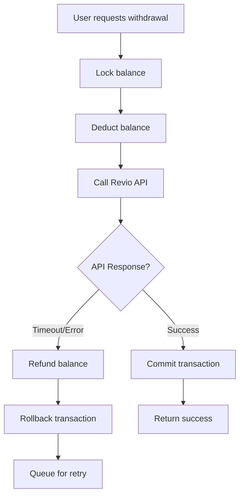
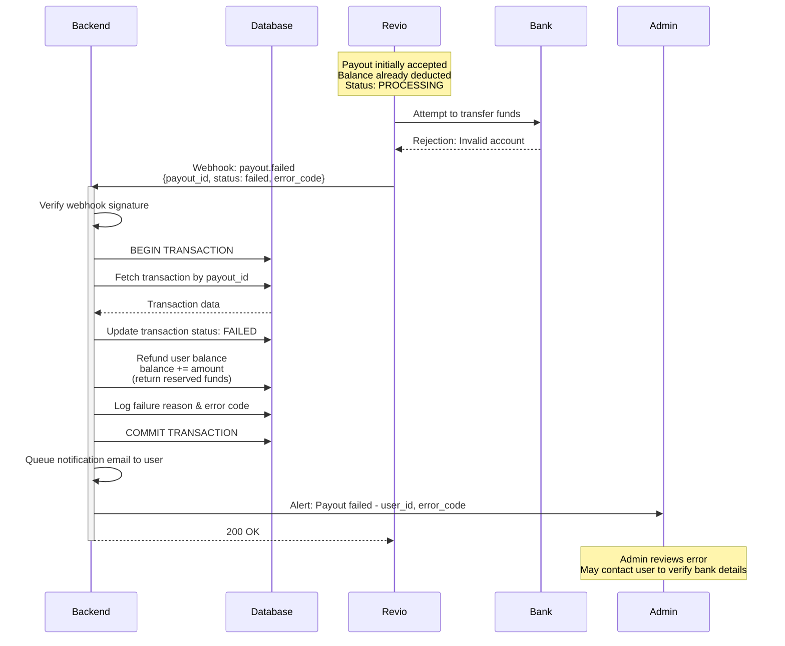

# Failure Handling & Recovery Design

## Overview
This document outlines how the system handles edge cases, failures, and recovery scenarios to maintain data consistency and resilience.

---

## Edge Cases & Risk Scenarios

### 1. Duplicate Transaction Scenarios

**Problem**: User submits withdrawal request multiple times (double-click, network retry, etc.)

**Prevention**:
- Frontend: Disable submit button after first click
- Backend: Idempotency key in request header
- Database: SERIALIZABLE isolation + SELECT FOR UPDATE locks user balance

**Recovery**: Second request either rejected (if first completed) or returns same result (if idempotent key matches)

**Already Covered**: Section 3 (Database locking), Section 4 (Withdrawal flow)

---

### 2. Revio API Downtime

**Scenario**: Revio API unavailable when creating deposit/withdrawal

**Impact**:
- Deposits: User cannot get checkout URL
- Withdrawals: Cannot create payout (balance already deducted!)

**Handling Strategy**:



**Recovery**:
- **Immediate**: Refund balance, rollback transaction, return error to user
- **Retry**: Queue failed request with exponential backoff (1 min, 5 min, 15 min)
- **Dead Letter**: After 3 retries, alert admin for manual intervention
- **User Communication**: Email notification explaining delay

---

### 2a. Payout Accepted But Fails During Bank Processing

**Scenario**: Revio accepts payout request (returns `payout_id`) but transfer fails later when actually sent to bank

**Root Causes**:
- Bank account doesn't exist (number is valid format but account closed/non-existent)
- Beneficiary name doesn't match account holder
- Bank rejects transfer for compliance/fraud reasons
- Recipient bank is experiencing technical issues
- Account cannot receive the currency or amount

**Why This Happens**:
- Revio can validate *format* of bank details immediately (correct number of digits, valid bank code)
- But Revio cannot know if account *actually exists* until they attempt the transfer
- Bank transfers are asynchronous (minutes to hours after payout creation)

**Flow**:



**Recovery**:
- **Automatic**: Webhook handler refunds balance, updates status to FAILED
- **User Notification**: Email explaining payout failed, funds returned, request to verify bank details
- **Admin Alert**: Sent to Slack with user ID, transaction ID, and error code for investigation
- **User Action**: User can retry withdrawal with corrected bank details

**Prevention**:
- Implement bank account verification flow before allowing withdrawals (micro-deposit confirmation)
- Store and validate against list of verified bank accounts per user
- Display clear instructions for correct bank detail format
- Use Revio's account validation API if available (pre-check before payout creation)

**Monitoring**:
- Track payout failure rate by error code
- Alert if failure rate > 10% (indicates systemic issue)
- Weekly report of common failure reasons

---

### 3. Network Failures

**Between Client and Backend**:
- Client timeout: Use request IDs to prevent duplicate submissions
- Connection lost: Frontend retry with same request ID

**Between Backend and Revio**:
- Timeout during payout creation: Assume failed, refund balance, retry later
- Timeout during webhook: Revio retries webhook (we handle idempotently)

**Between Backend and Database**:
- Transaction in progress: Use connection pooling with health checks
- If connection lost mid-transaction: Database auto-rollback (no partial commits)

---

### 4. Race Conditions

**Scenario 1**: Concurrent withdrawals from same account

**Solution**: Pessimistic locking (SELECT FOR UPDATE) - second withdrawal waits for first to complete

**Scenario 2**: Webhook arrives before user redirect

**Solution**: Both paths check transaction status idempotently - whoever updates first wins

**Scenario 3**: Multiple webhook deliveries (Revio retries)

**Solution**: Event ID deduplication - first insertion succeeds, duplicates rejected

**Already Covered**: Section 3 (Database design), Section 5 (Webhook handling)

---

### 5. Partial Failures

**Scenario**: Balance updated but email notification fails

**Approach**: Two-phase pattern
- Phase 1 (Critical): Update balance in transaction (must succeed)
- Phase 2 (Best-effort): Send email asynchronously via Celery

**Recovery**:
- Email task retries 3 times with exponential backoff
- If all retries fail: Log to dead letter queue, alert admin
- User still sees updated balance (critical path succeeded)

**Design Decision**: Don't rollback financial transaction due to email failure

---

## Recovery Mechanisms

### 1. Retry Logic with Exponential Backoff

**What Gets Retried**:
- External API calls (Revio, SendGrid)
- Webhook processing (if internal error, not validation failure)
- Background jobs (email, notifications)

**Retry Schedule**:
- Attempt 1: Immediate
- Attempt 2: 60 seconds
- Attempt 3: 5 minutes
- Attempt 4: 15 minutes
- After 4 failures: Dead letter queue

**Implementation**: Celery task retry decorator with countdown parameter

---

### 2. Dead Letter Queue (DLQ)

**Purpose**: Capture failed operations after max retries

**Contents**:
- Webhook events that couldn't be processed
- Failed payout creation attempts
- Failed email deliveries

**Process**:
1. Task fails after max retries
2. Logged to `failed_tasks` table with error details
3. Alert sent to admin Slack channel
4. Admin reviews and either:
   - Fixes root cause and replays
   - Manually processes (e.g., contacts user)
   - Marks as permanently failed

**Monitoring**: Alert if DLQ size > 10 items

---

### 3. Failure Detection

**Health Checks**:
- `/health` endpoint checks database, Redis, Celery worker connectivity
- Railway calls health endpoint every 30 seconds
- 3 consecutive failures triggers alert

**Automatic Alerts**:
- Database connection pool exhausted
- Celery workers not processing tasks (queue growing)
- Error rate spike (> 10x baseline)
- No webhooks received in 2 hours (unusual silence)

**Proactive Monitoring**:
- Query for transactions stuck in PENDING > 1 hour
- Query for PROCESSING withdrawals > 24 hours
- Daily reconciliation report (our records vs. Revio)

---

### 4. Recovery Procedures

**Scenario**: Webhook missed (never received)

**Detection**: Cron job finds PENDING deposits older than 1 hour

**Recovery**:
```
Every 15 minutes:
1. Query transactions WHERE status = 'PENDING' AND created_at < NOW() - INTERVAL '1 hour'
2. For each: Call Revio GET /purchases/{id} to check status
3. If paid: Process manually (same logic as webhook)
4. If failed: Update status to FAILED
5. Log reconciliation action
```

**Scenario**: Database backup restore needed

**Recovery**:
1. Restore from latest backup (Railway automatic daily backups)
2. Point-in-time recovery to just before incident
3. Replay webhook logs from time of backup to now
4. Verify balance consistency
5. Run reconciliation report

**Scenario**: Balance discrepancy detected

**Recovery**:
1. Lock user account (prevent new transactions)
2. Query all transactions for user from database
3. Query all transactions for user from Revio
4. Identify missing/duplicate records
5. Admin reviews and applies manual adjustment
6. Unlock account
7. Notify user of resolution

---

## Failure Handling Strategy Summary

### Critical Path (Must Succeed)
- Balance updates (strong consistency, ACID transactions)
- Transaction status changes (idempotent, retried)
- Webhook acknowledgment (must return 200 OK to Revio)

**Failure Response**: Rollback, refund, retry, escalate to admin

---

### Best Effort (Can Fail)
- Email notifications (user can check in-app)
- Analytics events (not critical to operation)
- Audit logs (logged to Sentry if fail)

**Failure Response**: Retry 3 times, then log to DLQ for later investigation

---

### Non-Critical (Degrade Gracefully)
- Transaction history pagination (return cached data)
- Admin dashboard metrics (show stale data with warning)

**Failure Response**: Serve cached/stale data with indicator

---

## Design Decisions

### Decision 1: Refund Immediately on Payout Failure vs. Hold Balance

**Choice**: Refund balance immediately if payout creation fails

**Rationale**:
- ✅ User can retry or use funds elsewhere
- ✅ Simpler state machine (no "reserved" state)
- ❌ User might withdraw again before retry completes
- **Mitigation**: If automatic retry succeeds, create new transaction

---

### Decision 2: Synchronous Webhook Verification vs. Queue Everything

**Choice**: Verify signature synchronously, process asynchronously

**Rationale**:
- ✅ Fast rejection of invalid webhooks (don't waste queue space)
- ✅ Idempotency check prevents duplicate processing
- ✅ Fast response to Revio (< 1 second)
- ❌ Signature verification could theoretically slow down endpoint
- **Acceptable**: Verification takes ~10ms, well within acceptable latency

---

### Decision 3: Manual Reconciliation vs. Automatic Adjustment

**Choice**: Alert admin for manual review before adjusting balances

**Rationale**:
- ✅ Prevents automated errors from propagating
- ✅ Financial adjustments require human oversight
- ✅ Creates audit trail of manual interventions
- ❌ Requires admin availability
- **Mitigation**: Clear runbooks for common scenarios

---

## Failure Handling Checklist

### Prevention
- [x] Database transactions prevent partial updates
- [x] Pessimistic locking prevents race conditions
- [x] Idempotency keys prevent duplicate processing
- [x] Input validation prevents invalid data
- [x] Rate limiting prevents abuse

### Detection
- [x] Health check endpoint
- [x] Error rate monitoring (Sentry)
- [x] Queue length monitoring
- [x] Stuck transaction detection (cron job)
- [x] Webhook silence detection

### Recovery
- [x] Automatic retry with exponential backoff
- [x] Dead letter queue for failed operations
- [x] Manual reconciliation process
- [x] Database backup and point-in-time recovery
- [x] Admin alert escalation

### Communication
- [x] User notifications (email for failed operations)
- [x] Admin alerts (Slack for anomalies)
- [x] Status page (optional for transparency)

---

## Summary

**Edge Cases Handled**:
- Duplicate transactions (idempotency + locking)
- Revio downtime (retry + DLQ + admin alert)
- Network failures (timeouts, connection pooling, health checks)
- Race conditions (pessimistic locking, event ID deduplication)
- Partial failures (two-phase pattern, best-effort async operations)

**Recovery Mechanisms**:
- Exponential backoff retry (4 attempts: immediate, 1min, 5min, 15min)
- Dead letter queue (manual admin review after max retries)
- Automated reconciliation (cron job checks missed webhooks every 15min)
- Health checks and monitoring (detect failures proactively)
- Manual procedures (balance adjustment, backup restore)

**Design Philosophy**:
- Critical path operations (balance updates): Strong consistency, automatic rollback on failure
- Best effort operations (emails): Retry, then DLQ
- Human in the loop (financial adjustments): Manual approval required
