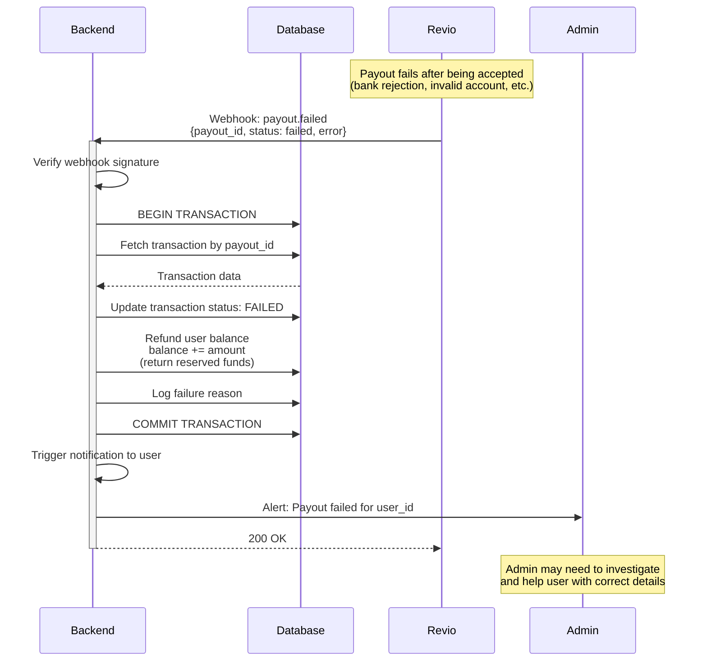

# Withdrawal Flow

## Overview
This diagram shows the complete flow for a user withdrawing funds from their account using Revio Pay.

## Sequence Diagram

```mermaid
sequenceDiagram
    participant User
    participant Frontend
    participant Backend
    participant Database
    participant Revio
    participant Bank as User's Bank

    User->>Frontend: Clicks "Withdraw" button
    Frontend->>Backend: GET /api/user/balance
    Backend->>Database: Fetch user balance
    Database-->>Backend: {balance: amount}
    Backend-->>Frontend: {balance: amount}
    Frontend->>User: Shows withdrawal form with available balance

    User->>Frontend: Enters amount & bank details<br/>(account number, bank code)
    Frontend->>Backend: POST /api/withdrawals<br/>{amount, bank_details}

    activate Backend
    Backend->>Backend: Validate user authentication
    Backend->>Database: BEGIN TRANSACTION
    Backend->>Database: SELECT balance FROM users<br/>WHERE id = user_id FOR UPDATE<br/>(pessimistic lock)
    Database-->>Backend: {balance: current_amount}

    alt Sufficient Balance
        Backend->>Backend: Validate: balance >= amount
        Backend->>Database: Create transaction record<br/>status: PENDING, type: WITHDRAWAL
        Database-->>Backend: transaction_id

        Backend->>Database: Update user balance<br/>balance -= amount<br/>(reserve funds immediately)

        Backend->>Revio: POST /payouts/<br/>{amount, currency, recipient_details,<br/>payout_method, reference}
        activate Revio

        alt Revio Accepts Payout
            Revio-->>Backend: {payout_id, status: unprocessed}
            Backend->>Database: Store payout_id in transaction<br/>status: PROCESSING
            Backend->>Database: COMMIT TRANSACTION
            Backend-->>Frontend: {transaction_id, status: PROCESSING}
            deactivate Backend

            Frontend->>User: Shows "Withdrawal processing" message

            Note over Revio: Revio processes payout<br/>(may take minutes to hours)

            Revio->>Bank: Transfer funds to user's bank
            activate Bank
            Bank-->>Revio: Transfer confirmation
            deactivate Bank

            Revio->>Backend: Webhook: payout.completed<br/>{payout_id, status, amount}
            activate Backend
            Backend->>Backend: Verify webhook signature<br/>(RSA-SHA256)
            Backend->>Database: Check idempotency<br/>(webhook already processed?)

            alt Not yet processed
                Backend->>Database: Update transaction status: COMPLETED
                Backend->>Database: Mark webhook as processed
                Backend->>Database: Log webhook delivery
                Backend-->>Revio: 200 OK
            else Already processed
                Backend-->>Revio: 200 OK (idempotent)
            end
            deactivate Backend

            Note over User: User receives notification<br/>(email/push/SMS)
            User->>Frontend: Checks transaction history
            Frontend->>Backend: GET /api/transactions/{transaction_id}
            Backend->>Database: Fetch transaction
            Database-->>Backend: Transaction data
            Backend-->>Frontend: {status: COMPLETED, amount}
            Frontend->>User: Shows completed withdrawal

        else Revio Rejects Payout
            Revio-->>Backend: Error: {error_code, message}
            Backend->>Database: Update transaction status: FAILED
            Backend->>Database: Refund user balance<br/>balance += amount<br/>(return reserved funds)
            Backend->>Database: COMMIT TRANSACTION
            Backend-->>Frontend: {error: "Payout failed", details}
            deactivate Backend
            Frontend->>User: Shows error message
        end
        deactivate Revio

    else Insufficient Balance
        Backend->>Database: ROLLBACK TRANSACTION
        Backend-->>Frontend: {error: "Insufficient balance"}
        deactivate Backend
        Frontend->>User: Shows insufficient balance error
    end
```

## Alternative Flow: Payout Failure After Processing



## Flow Steps Explained

### 1. User Initiates Withdrawal
- User clicks withdraw button
- Frontend fetches and displays current balance
- User enters withdrawal amount and bank details

### 2. Backend Validates & Reserves Funds
- Backend validates user authentication
- Begins database transaction with pessimistic lock on balance
- Checks if user has sufficient balance
- **Immediately deducts amount from balance** (reserves funds)
- Creates pending withdrawal transaction

### 3. Backend Creates Payout with Revio
- Calls Revio API to create payout
- Sends recipient bank details and amount
- Receives `payout_id` if successful

### 4. Revio Processes Payout
- Revio initiates bank transfer
- Processing time varies (minutes to hours)
- Revio sends funds to user's bank account

### 5. Webhook Processing
- Revio sends `payout.completed` or `payout.failed` webhook
- Backend verifies signature
- Updates transaction status
- If failed: refunds the reserved amount back to user balance
- Implements idempotency to handle retries

### 6. User Confirmation
- User receives notification (email/SMS/push)
- User can check transaction history
- Transaction shows as completed or failed

## Key Design Considerations

### Balance Reservation
- **Critical**: Deduct balance IMMEDIATELY when creating withdrawal
- This prevents user from withdrawing more than they have
- If payout fails, refund the amount back to balance
- Use pessimistic locking to prevent race conditions

### Concurrency Safety
```sql
BEGIN TRANSACTION;
SELECT balance FROM users WHERE id = ? FOR UPDATE;  -- Lock row
-- Validate balance >= amount
UPDATE users SET balance = balance - ? WHERE id = ?;
-- Create withdrawal transaction
COMMIT;
```

### Idempotency
- Webhooks may be retried
- Check if webhook already processed using:
  - Webhook delivery ID
  - Payout ID + event type combination
- Never refund balance twice

### Security
- Verify webhook signatures (RSA-SHA256)
- Validate user owns the bank account (via verification flow)
- Rate limit withdrawal attempts
- Implement daily/monthly withdrawal limits
- Require 2FA for large withdrawals (optional)

### Bank Details Verification
Consider implementing bank account verification before allowing withdrawals:
1. User adds bank account
2. Send micro-deposit (small amount like 1 cent)
3. User confirms amount received
4. Mark account as verified
5. Only allow withdrawals to verified accounts

### Transaction States
- **PENDING**: Initial state, validating request
- **PROCESSING**: Payout created with Revio, funds reserved
- **COMPLETED**: Payout successful, funds transferred
- **FAILED**: Payout failed, funds refunded to balance
- **CANCELLED**: User or admin cancelled (before processing)

### Failure Scenarios

#### Scenario 1: Revio API Call Fails
- Balance already deducted
- Payout creation fails (network error, Revio downtime)
- **Solution**: Refund balance immediately, mark transaction as FAILED

#### Scenario 2: Payout Rejected by Bank
- Balance already deducted
- Revio sends `payout.failed` webhook
- **Solution**: Refund balance via webhook handler

#### Scenario 3: Webhook Never Arrives
- Payout may be completed but no webhook received
- **Solution**: Implement polling mechanism:
  ```
  Cron Job (every 15 min) -> Check PROCESSING withdrawals older than 1 hour
  -> Call GET /payouts/{payout_id}
  -> Update status based on Revio response
  ```

#### Scenario 4: User Initiates Multiple Concurrent Withdrawals
- User clicks withdraw button multiple times rapidly
- **Solution**: Pessimistic locking prevents race condition
- Only one withdrawal can lock balance at a time

### Compliance & Fraud Prevention
- Log all withdrawal attempts (successful and failed)
- Monitor for suspicious patterns:
  - Multiple withdrawals to different accounts
  - Withdrawals immediately after deposits
  - Unusual amounts or frequencies
- Implement velocity checks (max N withdrawals per hour)
- Consider manual review for first withdrawal or large amounts

### Reconciliation
Implement daily reconciliation job:
1. Fetch all completed payouts from Revio for previous day
2. Compare with internal transaction records
3. Identify discrepancies
4. Alert admin for manual review

### User Experience Enhancements
- Show estimated processing time (e.g., "1-2 business days")
- Send status update notifications:
  - "Withdrawal processing"
  - "Withdrawal completed"
  - "Withdrawal failed - funds returned"
- Allow users to view payout status in real-time
- Provide clear error messages (invalid bank details, insufficient balance)

## Alternative Flow: Instant Withdrawals (Advanced)

For instant withdrawals (if Revio supports):
1. Use tokenized bank accounts
2. Charge premium fee for instant processing
3. Process via faster payment rails
4. Update transaction status immediately after Revio confirmation
